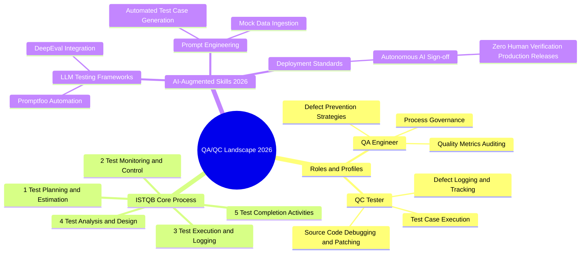

# you asked

message time: 2026-06-01 16:00:05

Act as an ISTQB-certified QA/QC expert. Please generate a detailed QA/QC mindmap focusing on QA/QC roles, standard testing processes, and required skills in the current 2026 AI-augmented job market.
Please format the output strictly using mermaid code so that I can easily visualize it or convert it into diagram.

---

# gemini response

