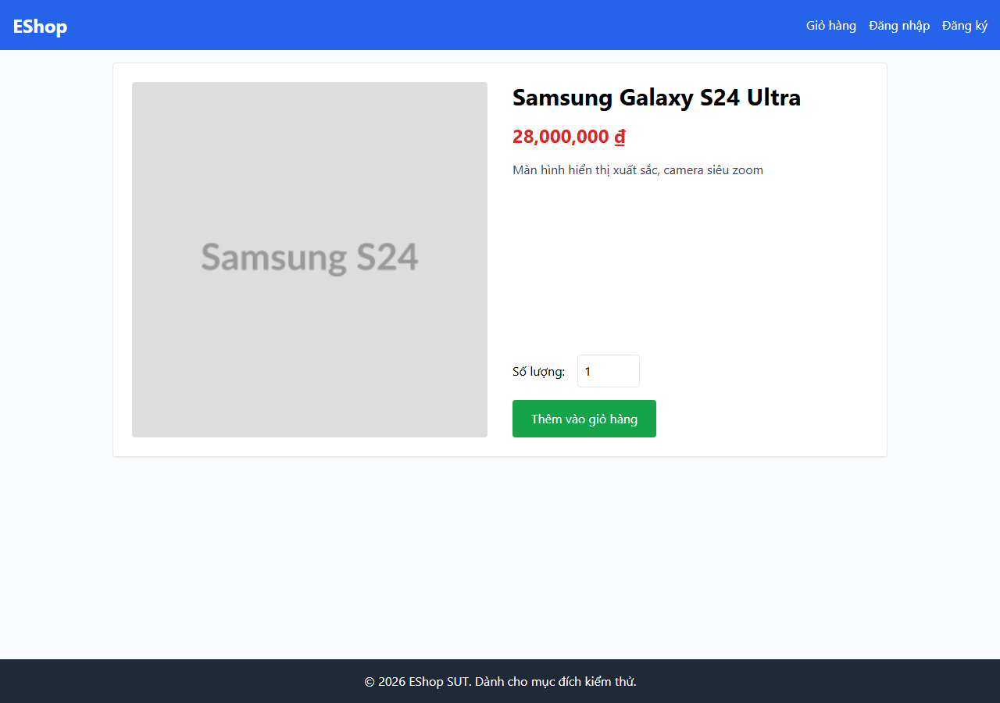

# Bug Report — HW02 Domain Testing on EShop

- **Student ID:** 23127184
- **GitHub Issues page:** https://github.com/KieuDuyennn/KTPM_23127184/issues 

Data cells (Input, Expected, Actual, screenshots) come from the recorded test run
(`TC_Checklist.md`, `test_execution_raw*.txt`, `screenshots/`). 

## Summary

| Candidate | Feature | Related TC | Bug ID | Severity | Is a bug? | Layer | GitHub Issue |
|---|---|---|---|---|---|---|---|
| C-01 | FR-01 | TC-01a, BVA-02, BVA-03 | BUG-01 | Major | Yes | UI |https://github.com/KieuDuyennn/KTPM_23127184/issues/6 |
| C-02 | FR-01 | pw `Test 1234` | BUG-01 | Major | Yes (same root) | UI |https://github.com/KieuDuyennn/KTPM_23127184/issues/7 |
| C-03 | FR-01 | TC-06..09 (UI); TC-03/05/11 (API) | BUG-02 | Critical | Yes | UI + API |https://github.com/KieuDuyennn/KTPM_23127184/issues/8 |
| C-04 | FR-06 | nonexistent id | BUG-03 | Minor | Yes | UI + API |https://github.com/KieuDuyennn/KTPM_23127184/issues/9 |
| C-05 | FR-06 | TC-01 price-type | BUG-04 | Major | Yes | UI + API |https://github.com/KieuDuyennn/KTPM_23127184/issues/10 |
| C-06 | FR-06 | TC-11 | BUG-05 | Critical | Yes | UI |https://github.com/KieuDuyennn/KTPM_23127184/issues/11 |
| C-07 | FR-06 | TC-04..08 | BUG-06 | Major | Yes | UI |https://github.com/KieuDuyennn/KTPM_23127184/issues/12 |
| C-08 | FR-11 | TC-03 | BUG-07 | Critical | Yes | API only (no UI) |https://github.com/KieuDuyennn/KTPM_23127184/issues/13 |
| C-09 | FR-13 | TC-04 | BUG-08 | Critical | Yes | API only |https://github.com/KieuDuyennn/KTPM_23127184/issues/14|
| C-10 | FR-13 | TC-05, TC-06, BVA-01..06 | BUG-09 | Critical | Yes | UI |https://github.com/KieuDuyennn/KTPM_23127184/issues/15 |

C-01 and C-02 are two directions of one defect (the password regex in `Register.jsx`), merged as BUG-01. C-03 is a separate backend defect (the `/api/register` endpoint has no validation), kept as BUG-02. Ten candidates map to nine bugs.

---

## C-01 — FR-01 registration (BUG-01)

**Title:** Password regex on the register form rejects valid passwords and requires a whitespace character

**REQ / TC:** FR-01, REQ-07..REQ-11 (password strength); TC-01a, BVA-02, BVA-03

**Steps:** Open `/register`, enter a valid name and email, enter password `Password123!`, click Đăng Ký. Repeat with `Pa1!abcd` and `Pa1!abcde`.

**Expected:** valid password accepted, redirect to Login.

**Actual (UI):** the form shows "Mật khẩu quá yếu!" and does not submit for all three valid passwords. Cause: the client regex in `Register.jsx` includes `(?=.*\s)`, which forces a whitespace character, and its character class `[A-Za-z\d\s]` excludes every special character, so a correct password (special char, no space) never matches.

**Screenshots:**

**Severity:** Major. It does not fully block registration since some strings still pass, but it directly breaks the password-strength requirement and stops valid users. No data loss or crash, so not Critical.

**Conclusion:** Bug. A password meeting every strength rule is rejected, which contradicts REQ-07..REQ-11, and the cause is explicit in the regex rather than a spec ambiguity.

---

## C-02 — FR-01 registration (BUG-01, same root)

**Title:** Weak password with no special character is accepted because it contains a space

**REQ / TC:** FR-01, REQ-11 (special character required); reverse direction of the regex

**Steps:** Open `/register`, enter a valid name and email, enter password `Test 1234`, click Đăng Ký.

**Expected:** rejected (missing special character).

**Actual (UI):** accepted, form redirects to Login. The same regex requires a space, so a string with a space but no special character still matches.

**Screenshot:**

**Severity:** Major (assessed with BUG-01).

**Conclusion:** Bug, but not independent. This is the reverse direction of the same regex and proves the defect both ways. Merged into BUG-01, since fixing the regex resolves both.

---

## C-03 — FR-01 backend has no validation (BUG-02)

**Title:** `/api/register` accepts invalid email format and duplicate email; also creates accounts on missing fields

**REQ / TC:** FR-01, REQ-01/02/05/06 (required fields, email format, uniqueness); TC-06..09 (UI), TC-03/05/11 (API-shape)

**Steps (UI, primary):** on `/register`, submit email `userdomain.com`, then `user@`, then `@domain.com`, then register the same email twice. Observe the result screen.

**Expected:** each case rejected with the matching validation error.

**Actual (UI):** the form has no email check, so each submit succeeds and redirects to Login, and the duplicate email registers a second account. Empty name/email are stopped by the HTML `required` attribute (so TC-02/04 are handled at the UI). The "missing field in body" cases (TC-03/05/11) cannot be reproduced from the UI because the form always sends all fields; they are recorded at the API layer only (`test_execution_raw*.txt`).

**Cause:** in `server.js`, the `/api/register` handler reads `{name, email, password}` and inserts directly, with no required/format check, and the email column has no UNIQUE constraint.

**Severity:** Critical. Invalid email format and duplicate accounts break account identity, and the backend has no validation layer at all, so any non-UI client bypasses the HTML checks.

**Conclusion:** Bug, separate from BUG-01. The email-format and uniqueness failures are visible from the UI; the root cause is a missing server-side validation layer, independent of the client regex.

---

## C-04 — FR-06 nonexistent product (BUG-03)

**Title:** `GET /api/products/:id` returns HTTP 200 with an empty body for a nonexistent id instead of 404

**REQ / TC:** FR-06, REQ-01/02; nonexistent id

**Steps:** open `/product/9999`; also call `GET /api/products/9999`.

**Expected:** a not-found response (e.g. HTTP 404).

**Actual (UI):** the page shows its empty-data state ("Sản phẩm không tồn tại"). Underneath, the endpoint returns `200` with body `{}`, because `server.js` uses `if (!row) return res.status(200).json({})` for the no-row case.

**Screenshot:**

**Severity:** Minor. The UI does not crash and shows a message; the issue is incorrect HTTP semantics (200 for a missing resource), which complicates automated clients but does not block the flow.

**Conclusion:** Bug. A missing resource returning success contradicts the expected not-found behavior. Low severity.

---

## C-05 — FR-06 price data type (BUG-04)

**Title:** Product price type is inconsistent: even ids return a string, odd ids return a number

**REQ / TC:** FR-06, REQ-07 (price display); TC-01 price-type

**Steps:** view product id 1 and product id 2, compare the `price` type in the response.

**Expected:** consistent numeric price for all products.

**Actual (UI):** the price still renders because the page uses `Number(product.price)`. Under that, `GET /api/products/1` returns `price=30000000` (number) and `GET /api/products/2` returns `price="28000000"` (string). Cause: `server.js` runs `if (row.id % 2 === 0) row.price = row.price.toString()`, forcing a string for even ids.

**Screenshot:**

**Severity:** Major. No immediate display error, but an inconsistent type is a latent defect for any client-side comparison, sort, or sum on price, and this same line causes the crash in C-06.

**Conclusion:** Bug. A consistent price type is a reasonable expectation, and the parity-based coercion is deliberate and abnormal in the code.

---

## C-06 — FR-06 server crash on null price (BUG-05)

**Title:** Viewing an even-id product with `price=null` crashes the backend process (`null.toString()`)

**REQ / TC:** FR-06, REQ-07; TC-11

**Steps:** with an even-id product whose `price` is null, open `/product/<even id>` (which calls `GET /api/products/<even id>`).

**Expected:** the empty price is handled safely.

**Actual (UI):** the page hangs on "Đang tải...". Cause: in `server.js` the even-id branch runs `row.price.toString()`, which is `null.toString()` when the price is null, throwing an uncaught TypeError that exits the backend process. An odd id does not hit this branch and shows "0 ₫".

**Screenshot:**

**Severity:** Critical. A syntactically valid read request takes down the whole server, so every other user loses service until restart, and it can be triggered on demand.

**Conclusion:** Bug. No reading of the spec makes crashing the server on a product view acceptable, and the cause is a clear unchecked `.toString()` on a nullable value. The coercion from BUG-04 creates the condition for this crash.

---

## C-07 — FR-06 quantity not validated (BUG-06)

**Title:** Quantity field on the product page accepts 0, negatives, decimals, letters, and empty

**REQ / TC:** FR-06, REQ-11/12 (quantity >= 1, integer); TC-04..08

**Steps:** on `/product/1`, enter quantity `0`, `-5`, `1.5`, `abc`, then empty, and add to cart (two clicks due to the `clickCount` logic). Observe the value passed to the cart.

**Expected:** invalid values rejected (CF-02, Prediction A).

**Actual (UI):** no validation; the value goes straight to the cart. In `ProductDetail.jsx`, `quantity` is passed through `parseInt(quantity)` into `addToCart(product, parseInt(quantity))` with no `>= 1` or integer check, so `-5` stays `-5`, `1.5` becomes `1`, and `abc`/empty become `NaN`.

**Screenshot:**

**Severity:** Major. Negative or NaN quantities in the cart directly affect cart and checkout correctness. Not Critical since it is one input flow with no crash or privilege escalation observed.

**Conclusion:** Bug. REQ-11/12 require quantity >= 1 and integer, and the current behavior ignores that entirely.

---

## C-08 — FR-11 viewing another user's order (BUG-07)

**Title:** `GET /api/orders/:id` has no auth or ownership check; anyone can read another user's order

**REQ / TC:** FR-11, REQ-02/07/08 (auth + ownership); TC-03

**Note:** `frontend-web` has no order-history page, so FR-11 is judged at the API layer only, which the checklist flags as an acceptable no-UI case (and the missing page is itself a gap).

**Steps:** in a browser with no login, open `http://localhost:3000/api/orders/1`; or send `GET /api/orders/<admin's order id>` with a `test@eshop.com` token.

**Expected:** denied (403 or 404).

**Actual (API):** HTTP 200 returning the full order of another user. In `server.js`, `app.get("/api/orders/:id", ...)` has no `authenticateToken` middleware and queries by id without filtering `user_id`. By contrast `/api/orders/my-orders` does use `authenticateToken`.

**Screenshot:**

**Severity:** Critical. This is an IDOR leaking order data, including shipping address and amount, to unauthorized and even unauthenticated callers.

**Conclusion:** Bug. The route lacks both authentication and ownership checks that the REQ requires.

---

## C-09 — FR-13 admin authorization (BUG-08)

**Title:** `GET /api/admin/orders` grants access to a normal user; the backend does not check role

**REQ / TC:** FR-13, REQ-10 (admin-only); TC-04

**Note:** the admin app blocks non-admins in `handleLogin` on the client, so at the primary (UI) layer this case passes; the defect only appears when the API is called directly, so it is an API-layer observation.

**Steps:** log in as `test@eshop.com` (role=user), take the token, send `GET /api/admin/orders` with it.

**Expected:** denied (403), admin-only.

**Actual (API):** HTTP 200 returning the order list. In `server.js`, the route only attaches `authenticateToken` (logged-in check) and never checks `req.user.role === "admin"`.

**Evidence:** API layer, `test_execution_raw.txt`.

**Severity:** Critical. Privilege escalation: a normal user reads system-wide admin data. The client-side role gate provides no protection once the API is open.

**Conclusion:** Bug. REQ-10 requires an admin-only endpoint; the client gate is not sufficient and the backend role check is missing. Several other `/api/admin/*` routes also carry only `authenticateToken`, so this is worth reviewing as a repeated pattern.

---

## C-10 — FR-13 revenue doubled (BUG-09)

**Title:** Dashboard revenue is doubled: each delivered order is multiplied by 2

**REQ / TC:** FR-13, REQ-05/06 (revenue = sum of delivered orders' total_amount); TC-05, TC-06, BVA-01..06

**Steps:** with one delivered order `total_amount = 100000` and one canceled order `50000`, log into the admin app, open the Dashboard, read the Revenue value against the orders table. Repeat with three delivered orders 1000/2000/3000.

**Expected:** revenue = sum of delivered orders' `total_amount`.

**Actual (UI):** the dashboard shows 200000 for one delivered order of 100000, and 12000 for the 1000/2000/3000 set (correct is 6000). Cause: in `frontend-admin/src/App.jsx`, `totalRevenue = orders.reduce(...)` uses `if (o.status === "delivered") return sum + o.total_amount * 2`. The `* 2` factor is wrong; non-delivered statuses are correctly excluded.

**Screenshots:**

**Severity:** Critical. Revenue is the core dashboard metric; a doubled figure makes every report and decision based on it wrong. Constant factor, reproduces 100 percent, confirmed across several BVA cases.

**Conclusion:** Bug. REQ-05/06 define revenue as the sum of delivered orders' `total_amount`; the `* 2` factor has no basis in the spec.

