# Test Case Checklist & Execution Results - HW02 (EShop)

- **Student ID:** 23127184
- **SUT:** EShop (`github.com/ttbhanh/eshop-sut`), executed 2026-07-07.
- **Testing level (per TA guidance, Hồ Tuấn Thanh, 01/07/2026):** functional testing takes its result from the **UI Frontend**. Where a feature has a UI, the UI-observed result is the primary result; the backend-API observation is kept as supporting evidence. Where a feature has **no UI** (see FR-11 note), only the API result exists - flagged explicitly.
- **Status legend:**
  - ✅ **Khớp** - observed behavior matches the designed Expected result.
  - ❌ **Lệch** - observed behavior differs from the designed Expected result.
  - ⚠️ **Có điều kiện** - the designed Expected result depends on an unresolved Open Question; the observed value is recorded but not scored here.
  - ⛔ **Không chạy được** - the case cannot be executed on the current build (reason stated).
- **Important:** "Lệch (❌)" means *observed ≠ designed expected*. It does **not** by itself mean "bug" - deciding which divergences are genuine defects, and writing the bug reports, is the student's task (course policy). This checklist only records what was observed.

---

## Summary

| Feature | UI available? | Designed TCs | Executed | ✅ Khớp | ❌ Lệch | ⚠️ Điều kiện | ⛔ Không chạy được |
|---|---|---|---|---|---|---|---|
| FR-01 Account Registration | Yes (web `/register`) | 31 | 31 | 11 | 10 | 8 | 2 |
| FR-06 Product Detail | Yes (web `/product/:id`) | 17 | 17 | 3 | 1 | 13 | 0 |
| FR-11 Order History | **No UI in frontend-web** | 11 | 11 | 6 | 1 | 4 | 0 |
| FR-13 Admin Dashboard | Yes (admin app) | 14 | 14 | 6 | 8 | 0 | 0 |
| **Total** | - | **73** | **73** | **26** | **20** | **25** | **2** |

> Counts of ✅/❌/⚠️ reflect the primary testing layer (UI where available). They are a factual tally of match/divergence against the *designed* expected result, not a bug count.

---

## FR-01 - Account Registration  (primary layer: UI register form)

The register UI validates the password client-side with the regex in `Register.jsx`
(`/^(?=.*[a-z])(?=.*[A-Z])(?=.*\d)(?=.*\s)[A-Za-z\d\s]{8,}$/`). Name/email have only the
HTML `required` attribute; the API performs no validation.

| ☐ | TC | Test condition | Designed Expected | UI result (primary) | Backend API result (evidence) | Status |
|---|---|---|---|---|---|---|
| ☑ | TC-01a | Valid strong pw `Password123!`, submit form | accepted → redirect to Login | **Blocked**: "Mật khẩu quá yếu" shown, no submit | (would be 200 if it reached API) | ❌ |
| ☑ | TC-01b | Valid registration via API | HTTP 200 `{message,id}` | - | HTTP 200 created | ✅ |
| ☑ | TC-02 | Name empty | rejected, missing field | HTML `required` blocks empty submit | HTTP 200 created (no validation) | ⚠️ |
| ☑ | TC-03 | Name field omitted (API-shape) | rejected, missing field | n/a (form always sends name) | HTTP 200 created | ❌ |
| ☑ | TC-04 | Email empty | rejected, missing field | HTML `required` blocks | HTTP 200 created | ⚠️ |
| ☑ | TC-05 | Email field omitted (API-shape) | rejected, missing field | n/a | HTTP 200 created | ❌ |
| ☑ | TC-06 | Email `userdomain.com` (no @) | rejected, invalid format | no client email check; submits | HTTP 200 created | ❌ |
| ☑ | TC-07 | Email `user@` (no domain) | rejected, invalid format | submits | HTTP 200 created | ❌ |
| ☑ | TC-08 | Email `@domain.com` (no local) | rejected, invalid format | submits | HTTP 200 created | ❌ |
| ☑ | TC-09 | Duplicate email (2nd registration) | rejected, duplicate | submits | HTTP 200 created (no UNIQUE constraint) | ❌ |
| ☑ | TC-10 | Password empty | rejected, password required | client regex rejects (weak-pw msg) | HTTP 200 created | ⚠️ |
| ☑ | TC-11 | Password field omitted (API-shape) | rejected, missing field | n/a | HTTP 200 created | ❌ |
| ☑ | TC-12 | Password `Pass1!` (6 chars) | rejected, weak | client regex **rejects** | HTTP 200 created | ✅ (UI) |
| ☑ | TC-13 | Password `password123!` (no uppercase) | rejected, weak | client regex rejects | HTTP 200 created | ✅ (UI) |
| ☑ | TC-14 | Password `PASSWORD123!` (no lowercase) | rejected, weak | client regex rejects | HTTP 200 created | ✅ (UI) |
| ☑ | TC-15 | Password `Password!` (no digit) | rejected, weak | client regex rejects | HTTP 200 created | ✅ (UI) |
| ☑ | TC-16 | Password `Password123` (no special) | rejected, weak | client regex rejects | HTTP 200 created | ✅ (UI) |
| ☑ | TC-17 | Confirm Password ≠ Password | rejected, mismatch | **no Confirm field exists in UI** | no `confirmPassword` in API | ⛔ |
| ☑ | TC-18 | Name `"   "` (whitespace) | conditional (OQ-04/10) | submits | HTTP 200 created | ⚠️ |
| ☑ | TC-19 | Email `user@domain` (no TLD) | conditional (OQ-11) | submits | HTTP 200 created | ⚠️ |
| ☑ | TC-20 | Email `user+tag@mail.domain.com` | conditional (OQ-11) | submits | HTTP 200 created | ⚠️ |
| ☑ | TC-21 | Case-insensitive duplicate email | conditional (OQ-09) | submits | HTTP 200 both created | ⚠️ |
| ☑ | TC-22 | Password `Password123#` (`#` off-set) | conditional (OQ-06) | client regex rejects | HTTP 200 created | ⚠️ |
| ☑ | TC-23 | Confirm Password empty | rejected | **no Confirm field exists** | no `confirmPassword` in API | ⛔ |
| ☑ | BVA-01 | Password 7 chars `Pa1!abc` | rejected, too short | client regex rejects | HTTP 200 created | ✅ (UI) |
| ☑ | BVA-02 | Password 8 chars `Pa1!abcd` | **accepted** (valid) | client regex **rejects** | HTTP 200 created | ❌ |
| ☑ | BVA-03 | Password 9 chars `Pa1!abcde` | **accepted** (valid) | client regex **rejects** | HTTP 200 created | ❌ |
| ☑ | BVA-04 | Name `A` (1 char) | accepted | submits | HTTP 200 created | ✅ |
| ☑ | BVA-05 | Name `An` (2 chars) | accepted | submits | HTTP 200 created | ✅ |
| ☑ | BVA-06 | Password `P` (1 char) | rejected, too short | client regex rejects | HTTP 200 created | ✅ (UI) |
| ☑ | BVA-07 | Password `Pa` (2 chars) | rejected, too short | client regex rejects | HTTP 200 created | ✅ (UI) |

**Ảnh minh chứng:**

TC-01a - mật khẩu đúng chuẩn `Password123!` bị từ chối ("Mật khẩu quá yếu"):

BVA-02 - mật khẩu hợp lệ 8 ký tự `Pa1!abcd` cũng bị từ chối:

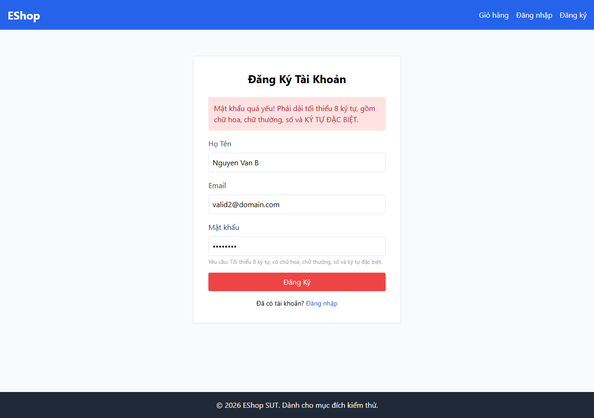

Chiều ngược lại - mật khẩu yếu `Test 1234` (không có ký tự đặc biệt, có khoảng trắng; vi phạm FR) lại được **chấp nhận**, form chuyển sang trang Đăng nhập:

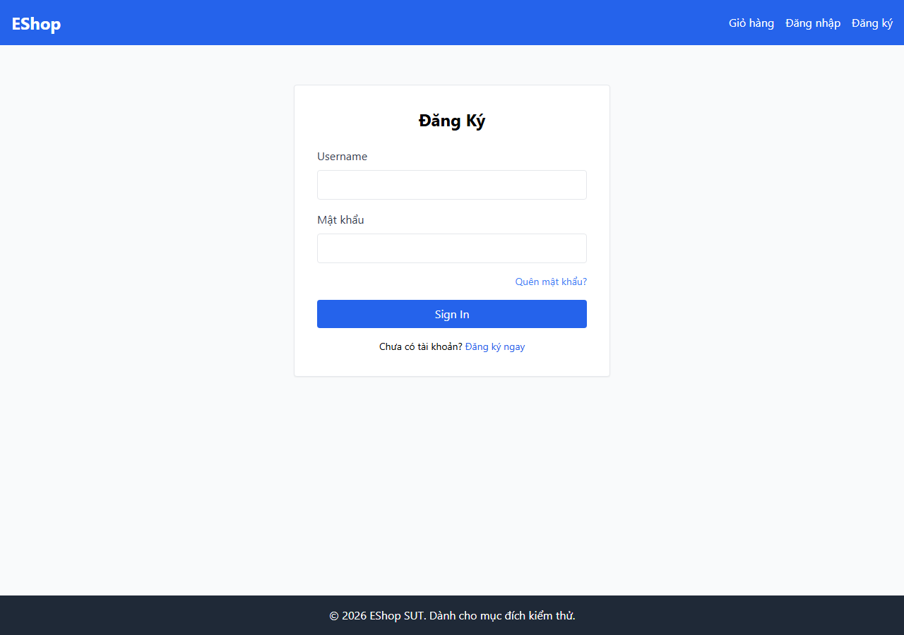

---

## FR-06 - Product Detail View  (primary layer: web `/product/:id`)

| ☐ | TC | Test condition | Designed Expected | Observed result | Status |
|---|---|---|---|---|---|
| ☑ | TC-01 | Existing product id=1 | all fields render; price numeric | renders; `price=30000000` (number) | ✅ |
| ☑ | TC-02 | Edge fixture (300-char name, price 0, broken img, category 9999) | screen handles each edge | renders; even id → `price="0"` (string); name 300 stored; category 9999 stored | ⚠️ |
| ☑ | TC-03 | Large price `999999999999` | renders without overflow | renders `999,999,999,999` | ⚠️ |
| ☑ | TC-04 | Quantity `0` | reject / default (CF-02) | no client validation; `parseInt→0` passed on | ⚠️ |
| ☑ | TC-05 | Quantity `-5` | reject / default (CF-02) | no validation; `-5` passed on | ⚠️ |
| ☑ | TC-06 | Quantity `1.5` | reject / default (CF-02) | `parseInt→1` (truncated); passed on | ⚠️ |
| ☑ | TC-07 | Quantity `abc` | reject / default (CF-02) | `parseInt→NaN`; passed on | ⚠️ |
| ☑ | TC-08 | Quantity empty | reject / default (CF-02) | `parseInt("")→NaN` | ⚠️ |
| ☑ | TC-09 | Image empty (`imageUrl=""`) | handles empty image | returns `imageUrl=""` | ⚠️ |
| ☑ | TC-10 | Name empty | handles empty name | returns `name=""` | ⚠️ |
| ☑ | TC-11 | Price null | handles empty price gracefully | **backend process CRASHES** (server.js:162 `null.toString()` on even-id product) | ❌ |
| ☑ | TC-12 | Description empty | handles empty description | returns `description=""` | ⚠️ |
| ☑ | TC-13 | Category null | handles empty category | returns `category_id=null` | ⚠️ |
| ☑ | BVA-01 | Quantity `0` (min−1) | reject / default (CF-02) | same as TC-04 | ⚠️ |
| ☑ | BVA-02 | Quantity `1` (min) | accepted | `parseInt→1`, accepted | ✅ |
| ☑ | BVA-03 | Quantity `2` (min+1) | accepted | `parseInt→2`, accepted | ✅ |
| ☑ | BVA-04 | Price `-1` (implicit floor−1) | render without crash (OQ-19) | even id → `price="-1"`; renders `-1` | ⚠️ |

Extra observation (not a numbered TC): `GET /api/products/9999` (nonexistent) → HTTP **200 + `{}`** (the UI then shows its empty-data screen).

**Ảnh minh chứng (chụp từ UI web `/product/:id`):**

TC-10 tên rỗng:

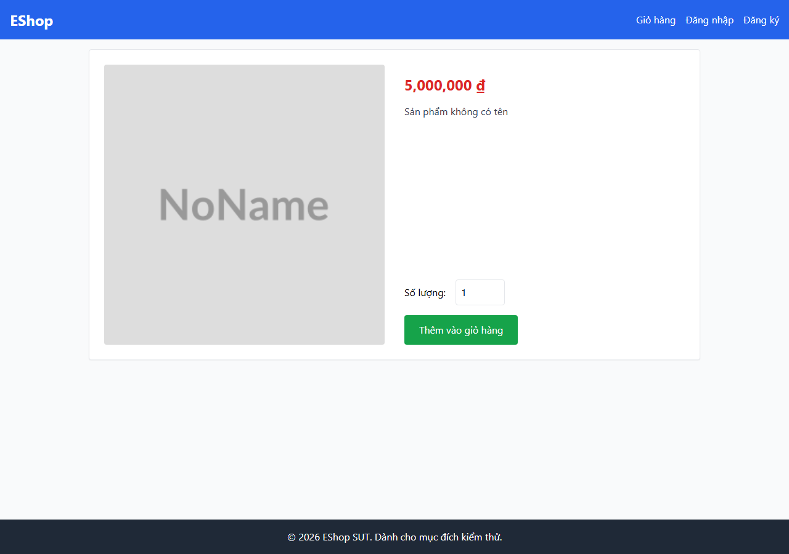

TC-09 ảnh rỗng:

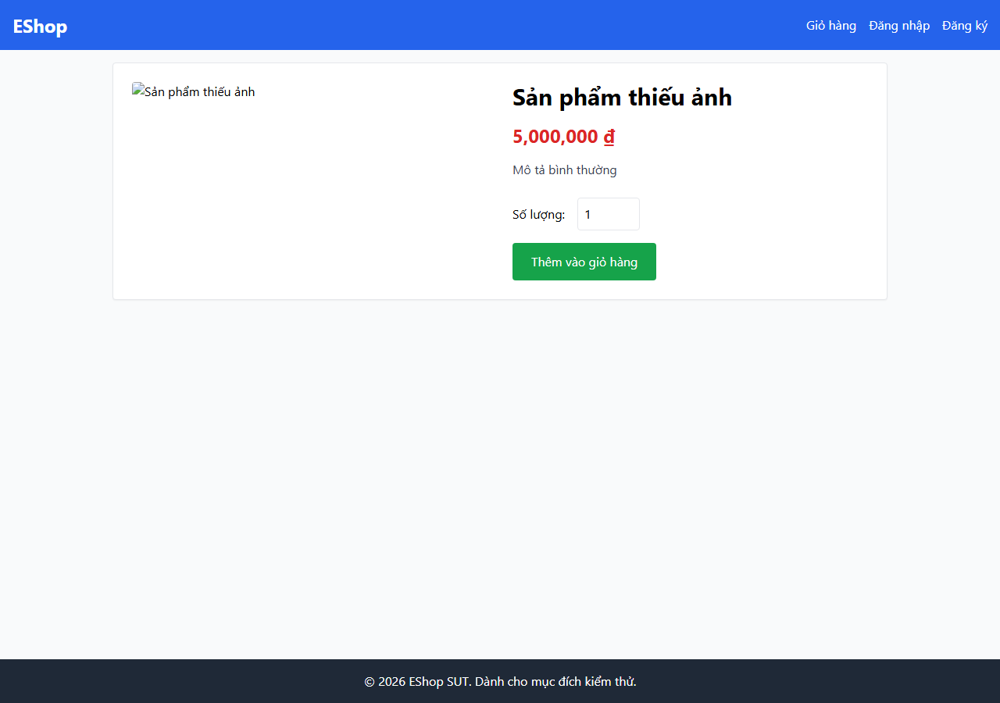

TC-12 mô tả rỗng:

TC-13 danh mục null (không hiển thị danh mục - xác nhận CF-01):

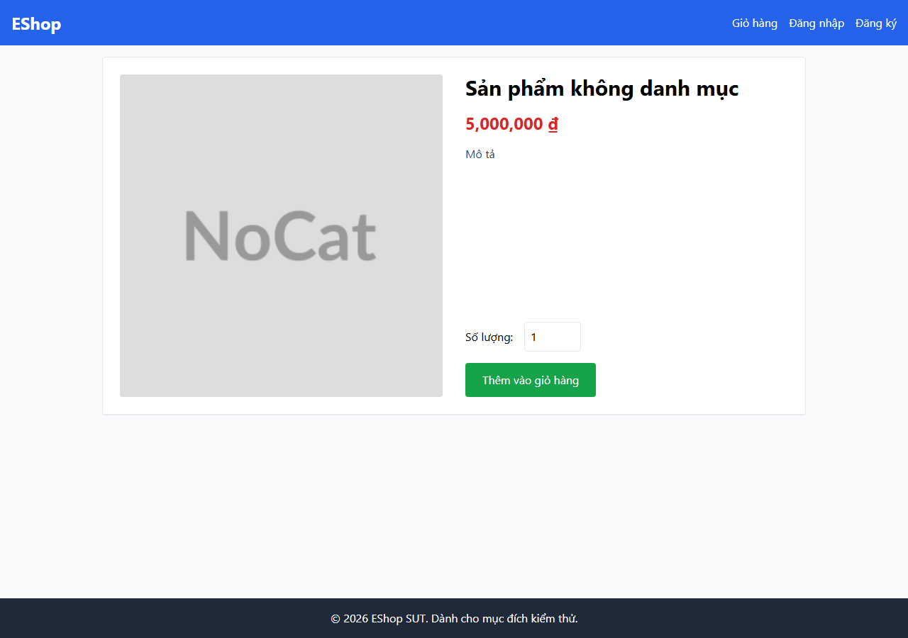

TC-02 fixture biên (tên 200 ký tự, giá 0, ảnh hỏng):

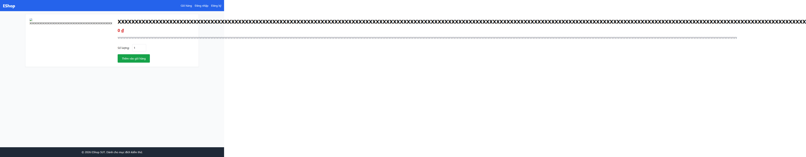

TC-11 giá null, id lẻ (không crash) - màn hình hiện "0 ₫" cho giá null:

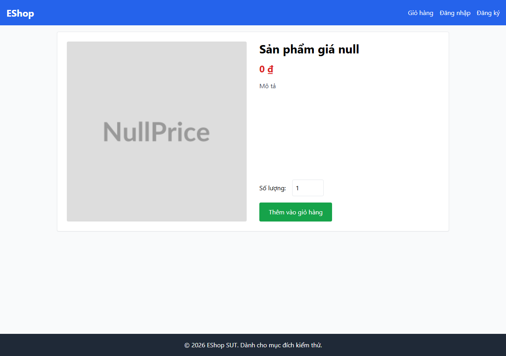

TC-11 giá null, id chẵn - **GET làm crash backend**, trang kẹt ở "Đang tải...":

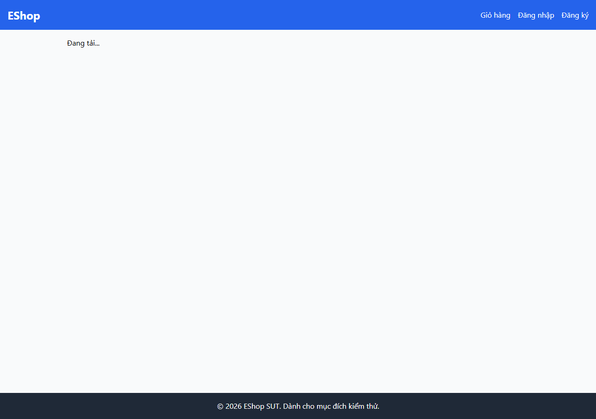

TC-05 số lượng `-5` được nhập không bị chặn:

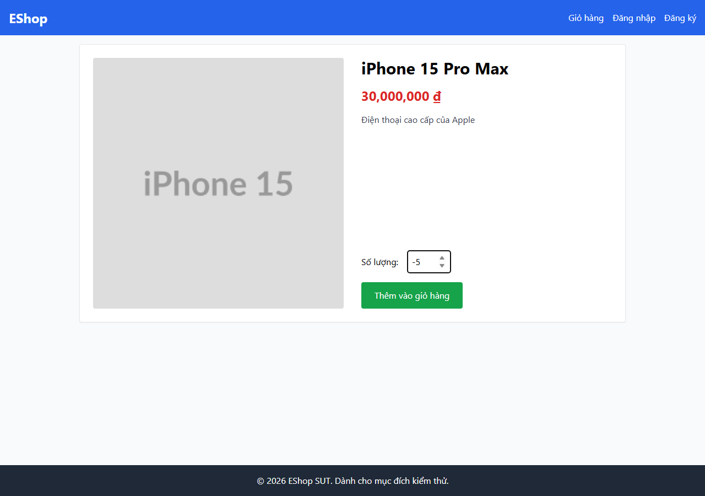

Sản phẩm không tồn tại `/product/9999` (API trả 200+`{}`):

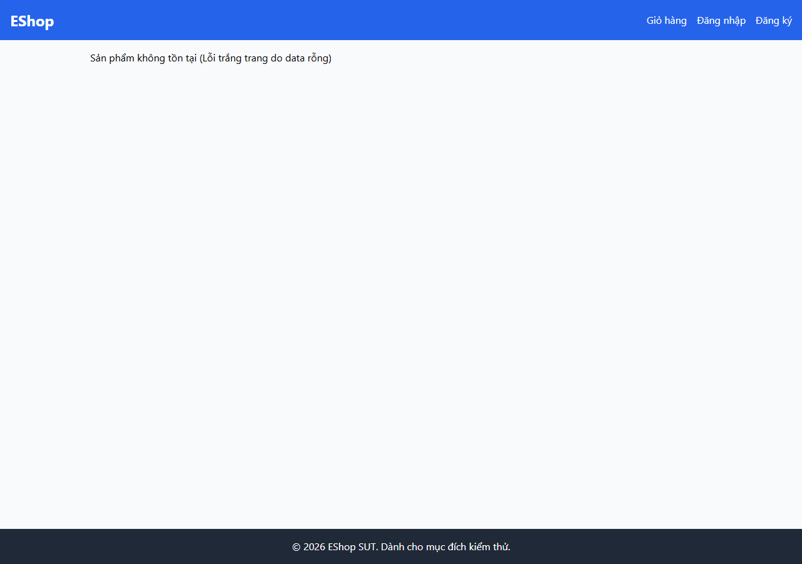

---

## FR-11 - Order History View  (⚠ no dedicated UI in frontend-web)

**Note (ties to the classmate Q&A):** `frontend-web` has no order-history page (its pages are
Home, Login, Register, ForgotPassword, Profile, ProductDetail, Cart, Checkout), and the
order flow stores locally without an order-history screen. FR-11 is therefore exercised at
the **API layer only** - there is no UI result to take. This gap is itself worth reporting.

| ☐ | TC | Test condition | Designed Expected | API result | Status |
|---|---|---|---|---|---|
| ☑ | TC-01 | `GET /my-orders`, own orders only | only own orders; other user's absent | returns only test's ids; admin order absent | ✅ |
| ☑ | TC-02 | `GET /orders/:id`, own order | order returned (canceled) | HTTP 200, own canceled order | ✅ |
| ☑ | TC-03 | `GET /orders/:id`, **another user's** order | denied (403/404) | HTTP **200**, returns admin's order (no ownership check) | ❌ |
| ☑ | TC-04 | `GET /my-orders`, no token | 401 | HTTP 401 Unauthorized | ✅ |
| ☑ | TC-05 | `GET /my-orders`, invalid token | 401/403 | HTTP 403 Forbidden | ✅ |
| ☑ | TC-06 | `GET /orders/999999` (nonexistent) | 404 | HTTP 404 Order not found | ✅ |
| ☑ | TC-07 | `GET /orders/abc` (malformed) | malformed-id error (OQ-13) | HTTP 404 Order not found | ⚠️ |
| ☑ | TC-08 | `GET /my-orders`, zero-order user | empty state | HTTP 200 `[]` | ✅ |
| ☑ | BVA-01 | `GET /orders/-1` | conditional (OQ-16/17) | HTTP 404 | ⚠️ |
| ☑ | BVA-02 | `GET /orders/0` | conditional (OQ-16/17) | HTTP 404 | ⚠️ |
| ☑ | BVA-03 | `GET /orders/1` | conditional (OQ-16/17) | HTTP 200, order returned | ⚠️ |

**Ảnh minh chứng (TC-03 / no-auth):**

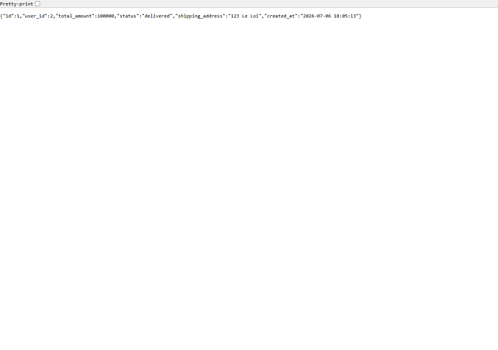

---

## FR-13 - Admin Dashboard  (primary layer: admin app dashboard)

Dashboard revenue is computed client-side in `frontend-admin/src/App.jsx` (L217-218:
`if (o.status === "delivered") return sum + o.total_amount * 2;`).

| ☐ | TC | Test condition | Designed Expected | Observed result | Status |
|---|---|---|---|---|---|
| ☑ | TC-01 | Admin views dashboard/orders | success | HTTP 200, orders returned; dashboard renders | ✅ |
| ☑ | TC-02 | No token | denied (401) | HTTP 401 Unauthorized | ✅ |
| ☑ | TC-03 | Malformed token | denied (401/403) | HTTP 403 Forbidden | ✅ |
| ☑ | TC-04 | Non-admin valid token (role=user) | **denied (403)** | HTTP **200**, 3 orders returned (access granted) | ❌ |
| ☑ | TC-05 | Revenue = delivered only (100 delivered + 50 canceled) | revenue = 100 | dashboard shows **200** (delivered×2) | ❌ |
| ☑ | TC-06 | Revenue excludes pending/confirmed/shipping | sum of delivered only | non-delivered excluded, but delivered **doubled** | ❌ |
| ☑ | TC-07 | Zero orders in system | revenue 0, count 0 | revenue 0, count 0 | ✅ |
| ☑ | TC-08 | Orders exist, none delivered | revenue 0 | revenue 0 | ✅ |
| ☑ | BVA-01 | Delivered `total_amount = -1` | reflect −1 | stored −1; contributes −2 (doubled) | ❌ |
| ☑ | BVA-02 | Delivered `total_amount = 0` | reflect 0 | stored 0; contributes 0 | ✅ |
| ☑ | BVA-03 | Delivered `total_amount = 1` | reflect 1 | stored 1; contributes 2 (doubled) | ❌ |
| ☑ | BVA-04 | Delivered `total_amount = -0.01` | reflect −0.01 | stored −0.01; contributes −0.02 (doubled) | ❌ |
| ☑ | BVA-05 | Delivered `total_amount = 0.01` | reflect 0.01 | stored 0.01; contributes 0.02 (doubled) | ❌ |
| ☑ | BVA-06 | 3 delivered orders 1000/2000/3000 | revenue 6000 | dashboard shows **12000** (doubled) | ❌ |

**Ảnh minh chứng (TC-05 / doanh thu nhân đôi):**

Dashboard hiện doanh thu 200.000 ₫ trong khi chỉ có 1 đơn delivered = 100.000 ₫:

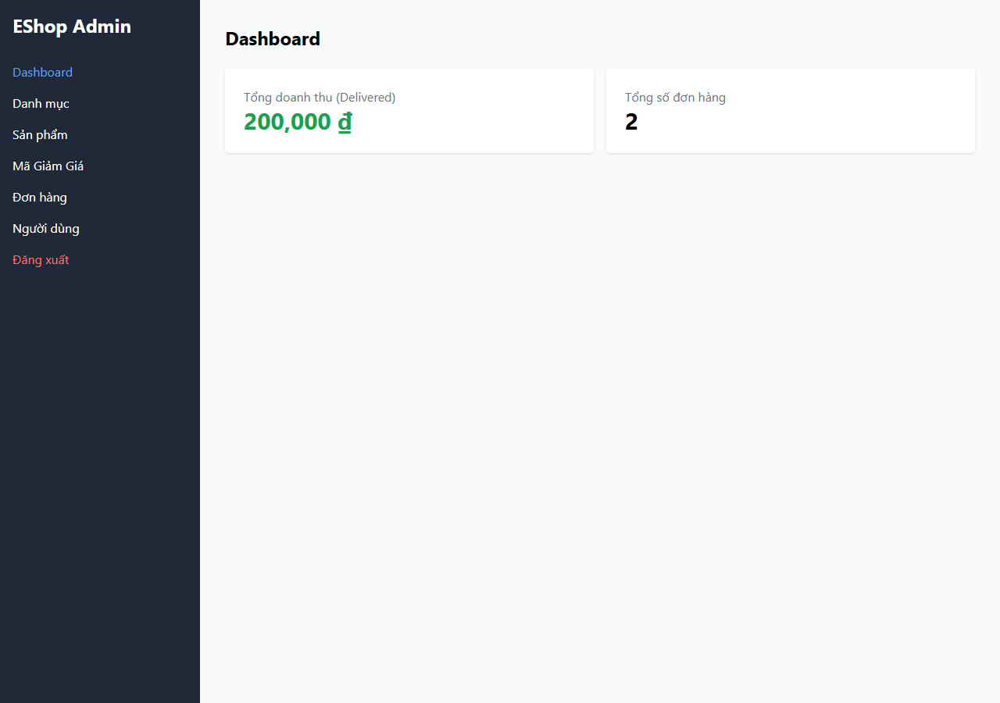

Bảng đơn hàng đối chiếu (delivered = 100.000, canceled = 50.000):

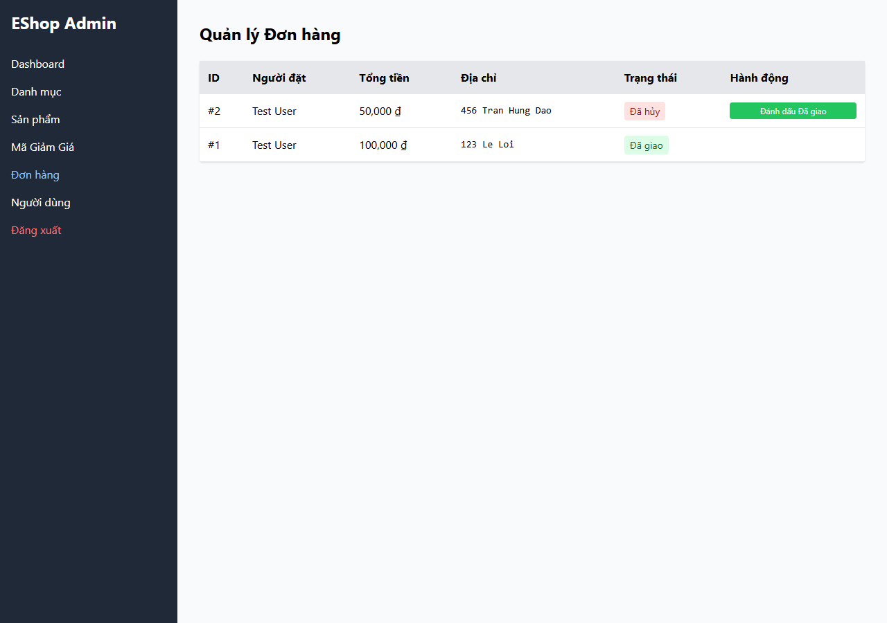

---

## Các case không có ảnh chụp và lý do (minh bạch)

Không phải case nào cũng chụp được màn hình - một số chỉ tồn tại ở tầng API hoặc bị chặn ở tầng khác. Ghi rõ để không bịa ảnh:

| Nhóm case | Vì sao không có screenshot UI |
|---|---|
| FR-01 TC-03/05/11 (thiếu field trong body) | "Bỏ field khỏi JSON" là khái niệm ở tầng API - form UI luôn gửi đủ field, không tái hiện được trên UI. Bằng chứng ở `test_execution_raw*.txt`. |
| FR-01 TC-02/04 (name/email rỗng) | Bị thuộc tính HTML `required` chặn ngay, không submit được - không có màn hình lỗi riêng của app. |
| FR-01 TC-06/07/08/09 (email sai/trùng) | UI không kiểm email; submit sẽ đăng ký thành công rồi chuyển trang Đăng nhập (giống ảnh weak-pw-accepted). Bằng chứng rõ nhất ở tầng API. |
| FR-01 TC-17/23 (Confirm Password) | Không có field Confirm Password trong UI để chụp (chính là quan sát). |
| FR-11 toàn bộ | `frontend-web` không có trang lịch sử đơn hàng - không có UI. Chỉ có ảnh API `fr11_order_by_id_no_auth.png`. |
| FR-13 TC-04 (token user vào admin API) | App admin chặn non-admin ở tầng client; lỗi (API vẫn cho vào) chỉ thấy ở tầng API - bằng chứng ở `test_execution_raw.txt`. |
| Các dòng ✅ Khớp | Đúng như thiết kế, không cần chụp (theo yêu cầu chỉ chụp trừ case OK). |

## How to read this for the bug report (student's task)

The ❌ rows (and the crash in FR-06 TC-11) are the natural starting points for bug
descriptions. For each, you already have: the exact input, the designed expected, the
observed actual (here + in `test_execution_raw*.txt`), and a screenshot where a UI exists.
Deciding which of these are genuine defects vs. spec ambiguities (⚠ rows), assigning
severity, and writing the reproduction narrative is yours to do.
