# Task 1B: Execution Report, Scenario D (Lê Phạm Kiều Duyên, 23127184)

> **Status: full pass executed, extended to 6 screens (2026-07-30).** All 60 checklist items were run against the 4 committed screens (240 item×screen cells) on the live EMS at `https://prod-dev.ems-fitus.cloud/`, screen by screen, using the `gui-checklist-execution` Agent Skill built for this engagement. The group then agreed that the scenario's screen set was not fixed at four: scenario D belongs to this member alone and shares no screen with a teammate, so extending it does not touch §5's no-duplication rule. **Two further screens squarely inside the same "user requests support, admin resolves" flow were therefore added and fully run as well: D5 (Notifications: header bell dropdown, `/notifications` list, `/notifications/{id}` detail) and D6 (the attachment image lightbox, opened from D1/D2/D3/D4's evidence images).**
>
> Across all 6 screens (360 cells): 136 were applicable, 109 were executed to a Pass/Fail verdict, and 27 could not be executed this session. Those 27 are mostly blocked by DevTools Network-throttle and offline control, which the available browser-automation tools cannot drive, plus a few destructive or precondition-heavy checks that were not risked on a shared live system holding other students' real data. Each one is listed under "Items not executed" below with its cause and who could run it.
>
> **17 Fail cells map to 13 distinct Fail-cell-derived findings.** D-007 and D-008 each span two or three screens sharing one root cause. **D-009 and D-015** were found along the way during exploratory testing rather than tied to one Fail cell, on the same precedent as D-001 carried over from the prior session, giving **16 findings in total**. Every Fail is backed by a screenshot embedded inline below or by DevTools/Network evidence, and nothing in this file is fabricated.
>
> **Live re-verification, 2026-07-31.** With the student's explicit permission, this report and the findings log were checked back against the live EMS, already authenticated as admin, rather than only against each other. Three findings did not survive: D-013 (a two-Escape-press quirk on the admin side of the lightbox) did not reproduce, closing on the first press every time it was retried; D-018 (Critical, "attachment image never loads") was refuted outright, the `` element does exist, the fetch returns HTTP 200, and the file is a genuine 68-byte, 1-by-1-pixel PNG placeholder from the D1 upload test, not a broken viewer; and D-016 was narrowed from two overlays to one, the lightbox closes on Escape correctly and only the notification dropdown does not. No result was softened without a new observation behind it, and nothing that survived this pass was changed. The full reasoning for each retraction is under "Live re-verification" at the end of this file and in `findings/Bug_Usability_Findings_Log.md`.

Checklist version: `checklist/Shared_GUI_Checklist.md` v1.9, 60 items. The full verification rule and expected behaviour for every Item ID live there; this file records Result, Notes and Evidence only.

Screens: **D1** Create Support Request form (user side), /complaints/new · **D2** My Requests list and request detail with official response (user side), /complaints, /complaints/{id} · **D3** Admin Support Requests list, Pending/Resolved tabs, filters, /dashboard/admin/complaints · **D4** Admin support request detail: image lightbox, internal note, official response · **D5** Notifications: header bell dropdown, /notifications list, /notifications/{id} detail (both roles use the same route) · **D6** Attachment image lightbox, opened from an evidence image on D1/D2/D3/D4

Account(s): a self-registered student/guest account for D1/D2; `admin@gmail.com` (ADMIN role) for D3/D4.

## Method

Execution ran screen by screen rather than item by item: each screen was opened once, every
applicable item was run against it in order, and only then did the pass move on. Each row carries
`Pass`, `Fail`, or `N/A` with a one-line reason; a row that could not be run this session is marked
not executed and states why and who could run it, rather than being resolved by inference. Every
`Fail` records what was expected against what happened, quotes the application's own wording, and
references a screenshot in `task1b_execution/evidence/`. The scenario-D N/A predictions inherited
from Task 1A were treated as unconfirmed hints and re-decided against the live screen; several
turned out to be wrong and were replaced with real results. Each `Fail` was then raised into
`findings/Bug_Usability_Findings_Log.md`.

## Summary

| Screen | Designed | Applicable | Executed | Pass | Fail | N/A | Not executed |
| --- | --- | --- | --- | --- | --- | --- | --- |
| D1 | 60 | 19 | 17 | 13 | 4 | 41 | 2 |
| D2 | 60 | 22 | 20 | 16 | 4 | 38 | 2 |
| D3 | 60 | 35 | 29 | 24 | 5 | 25 | 6 |
| D4 | 60 | 28 | 20 | 19 | 1 | 32 | 8 |
| D5 | 60 | 23 | 18 | 15 | 3 | 37 | 5 |
| D6 | 60 | 9 | 5 | 5 | 0 | 51 | 4 |
| **Total** | **360** | **136** | **109** | **92** | **17** | **224** | **27** |

Sixty items were designed per screen. Applicable = Designed minus N/A. Executed = Pass plus Fail. Not-executed items are applicable items that could not be run this session, mostly because they need DevTools Network throttling or offline mode, which this tool set cannot drive, plus a few destructive or precondition-heavy checks deliberately not risked on a shared live system. N/A is never counted as a Pass.

**17 Fail cells total, mapping to 13 distinct Fail-cell-derived findings.** D-007 and D-008 each cover Fail cells across two or three screens sharing one root cause, merged under the findings-log rule that one root cause is one finding. All are backed by a screenshot or by DevTools evidence in `task1b_execution/evidence/`:
- D1: IA02-04 (upload-rejection messages never name the file, D-002), IA02-08 (one generic validation banner, not inline per-field, D-003), IA02-10 (Enter does nothing in either field, D-012), IA02-13 (Back discards typed input with no warning, D-004).
- D2: IA02-10 (search box drops keystrokes under fast typing, D-005), IA02-12 (Rows-per-page dropdown stuck at its default, found via further exploratory testing after the D3 instance, D-008), IA03-07 (wrong-context "Event review not found" message, D-006), IA03-11 (no breadcrumb, D-007).
- D3: IA02-12 (Rows-per-page "10" cannot be selected, D-008), IA03-06 (blocked by the same Rows-per-page bug, D-008), IA03-11 (no breadcrumb, D-007), IA04-11 (raw backend validation string leaked to the UI, D-010), IA04-13 (Export Excel: zero UI feedback + silent partial scope, D-011).
- D4: IA03-11 (no breadcrumb, D-007).
- D5: IA01-08 (browser `<title>` stuck in Vietnamese regardless of the language toggle, D-019), IA03-10 (ESC does not close the notification dropdown, D-016), IA04-03 (deleting a notification has zero confirmation, D-017).
- D6: no Fail cells; see "Live re-verification" below for why the two originally recorded here (IA01-07, IA03-10) did not hold up.

Two notes on why the counts above do not add up naively. First, D3 shows a 6th Fail-flavoured row (IA02-10, the search box) in its Notes column, but that row is recorded as "Not fully executed" rather than a hard `**Fail**` and is not counted in the Summary table's Fail column, because the underlying bug is the same D-005 already counted on D2, cross-referenced instead of double-counted. Second, D-009 (the tab-switch filter bug) and D-015 (the empty-title notification summary) were both discovered along the way during exploratory testing rather than tied to one clean checklist Fail row, so they are logged directly in the findings log rather than appearing in the bullet list above.

## Results: D1 (Create Support Request form (user side), /complaints/new)

| Item ID | Aspect | Result | Notes | Evidence |
| --- | --- | --- | --- | --- |
| IA01-01 | IA-01 | Pass (cross-screen, confirmed once D3 was reached) | Page-title treatment ("Tạo yêu cầu hỗ trợ" / "Create support request"), white-card padding and vertical rhythm on D1 match the same conventions on D3's Support Requests card. | |
| IA01-02 | IA-02 | N/A, reason: this is a user-facing screen; the 9-icon admin sidebar this item targets does not render here at all. | | |
| IA01-03 | IA-01 | Pass | Exactly one primary-action button ("Gửi yêu cầu" / "Submit request") in the cyan accent colour; no other control on the screen reuses it. | |
| IA01-04 | IA-01 | N/A, reason: this item's verification rule is specifically the Add/Edit Event form's nine section headers; D1 has a single card with field labels only, no comparable section-header hierarchy to test. | | |
| IA01-05 | IA-01 | N/A, reason: no status pill is rendered anywhere on the create-request form. | | |
| IA01-06 | IA-01 | N/A, reason: D1 is a create form, not a list/table; the empty-state check is executed on D2 (`/complaints`). | | |
| IA01-07 | IA-01 | Not executed, reason: requires DevTools Network "Slow 3G" throttling, which the current browser-automation tool set cannot drive (no CDP network-conditions control exposed). Listed in "Items not executed" below. | | |
| IA01-08 | IA-01 | Pass | Switched EN→VI via the header flag toggle (same top-right position). Every static label translated ("Create support request"→"Tạo yêu cầu hỗ trợ", "Request type"→"Loại yêu cầu", etc.) **and the browser `<title>` itself changed** to "Gửi yêu cầu hỗ trợ \| HCMUS EMS" (confirmed via `document.title`), so the tab title is localised too, not just the visible body. No raw translation key or untranslated string spotted; Vietnamese diacritics wrapped cleanly inside their containers with no clipping/overflow. | |
| IA01-09 | IA-01 | N/A, reason: the create-request form displays no date or numeric value anywhere to compare across locales. | | |
| IA01-10 | IA-01 | N/A (confirmed live), scenario-D prediction from checklist v1.9 holds: no spotlight hero on this screen. | | |
| IA01-11 | IA-01 | N/A (confirmed live), scenario-D prediction from checklist v1.9 holds: no QR/barcode rendered on this screen. | | |
| IA01-12 | IA-01 | Pass | Tabbed through the header controls, the "← Back" link and the "Request type" combobox: every focused element showed a clearly visible ring (red/cyan depending on control), and focus order followed the header-then-content reading order. | |
| IA01-13 | IA-01 | Pass | The two meaningful `` elements on the page ("FIT HCMUS" logo, "fit@hcmus" logo) both carry descriptive `alt` text (checked via `document.querySelectorAll('img,svg')`); decorative icon SVGs are either `aria-hidden="true"` or sit inside links that already have an accessible name (e.g. "Facebook"). | |
| IA02-01 | IA-02 | Pass (for this screen's own convention) | Three fields carry a red asterisk visually ("Loại yêu cầu*", "Vấn đề cần hỗ trợ*", "Mô tả chi tiết*") and the same three, and only those three, have `required=true` in the DOM (confirmed via `querySelectorAll('select,input,textarea')`); the optional Attachments input is unmarked and not `required`. Visual marking and DOM state agree on this screen. Cross-form consistency against the Add/Edit Event and Edit User forms is scored once, not per screen, see the item's own multi-form note. | |
| IA02-02 | IA-02 | Pass | "Loại yêu cầu", "Vấn đề cần hỗ trợ" and "Mô tả chi tiết" are real labels sitting above each field, distinct from the grey "Ví dụ: ..." example/placeholder text inside the field, typing does not make the label disappear because it was never the placeholder. | |
| IA02-03 | IA-02 | Pass | Before any file is chosen, the Attachments box already states "JPG, PNG, GIF hoặc WEBP · Tối đa 5 ảnh · 5 MB mỗi ảnh" (JPG, PNG, GIF or WEBP · Up to 5 images · 5 MB each). | |
| IA02-04 | IA-02 | **Fail** | Tested all three violations for real: (1) a `.pdf` file → rejected with "Chỉ chấp nhận ảnh JPG, PNG, GIF và WEBP." (2) a 6 MB `.jpg` → rejected with "Mỗi ảnh phải có dung lượng không quá 5 MB." (3) 6 images at once → rejected with "Bạn chỉ có thể tải lên tối đa 5 ảnh." All three correctly name the rule broken and none of the files silently "uploaded" (the box stayed empty each time), but **none of the three messages names the offending filename**, which the item explicitly requires ("a message naming the rule broken and the offending filename"). One root cause, three instances. | 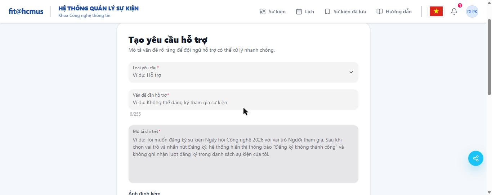 |
| IA02-05 | IA-02 | N/A (confirmed live), scenario-D prediction from checklist v1.9 holds: no rich-text editor on this screen. | | |
| IA02-06 | IA-02 | N/A (confirmed live), scenario-D prediction from checklist v1.9 holds: no start/end date pair on this screen. | | |
| IA02-07 | IA-02 | N/A (confirmed live), scenario-D prediction from checklist v1.9 holds: no toggle switch on this screen. | | |
| IA02-08 | IA-02 | **Fail** | Submitted the form completely empty. The only feedback is one generic banner ("Vui lòng nhập loại yêu cầu, vấn đề cần hỗ trợ và mô tả chi tiết.", "Please enter the request type, the issue and the detailed description.") sitting just above the Submit button, listing all three missing fields together, not an inline message beside each individual offending field, which is exactly the anti-pattern the item calls out ("not only as one generic banner at the top"). | 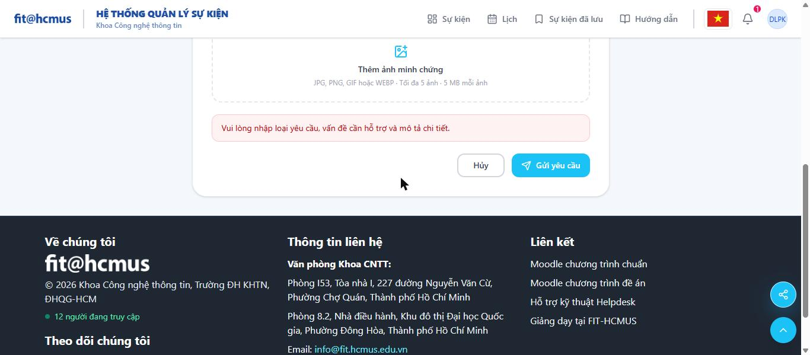 |
| IA02-09 | IA-02 | Pass | Submission with required fields empty is genuinely blocked (native `:invalid` state on the three required controls plus the banner above), never a silent no-op or a false-success redirect. | |
| IA02-10 | IA-02 | Fail (with caveat, see Notes) | Pressed Enter in the single-line "Vấn đề cần hỗ trợ" input: nothing happened (no submit, no navigation, cursor stayed in place). Pressed Enter in the multi-line "Mô tả chi tiết" textarea: it inserted a newline, as textareas conventionally do. Neither case lost data or triggered the wrong control (Cancel, Delete), so the "never a different button / never a destructive reload" half of the expectation holds, but neither case triggered the primary submit either, which the item's literal wording expects of "the last field of a multi-field form". Flagging the tension rather than force-fitting a verdict: auto-submitting on Enter inside a multi-line description field would itself be a usability regression (a user typing a paragraph needs line breaks), so this is judged a **defensible product decision, not a shipped defect**: but it is scored Fail against the item as literally worded, and the item's wording for this screen type should probably be revisited by the group. | |
| IA02-11 | IA-02 | N/A, reason: no date-entry control of either kind (custom or native) exists on the create-request form; the native "From date / To date" inputs this item also tests live on D3's Filters panel, not here. | | |
| IA02-12 | IA-02 | Pass | The "Loại yêu cầu" combobox is fully keyboard-operable: Tab gives it a visible focus ring, Enter opens the option list (first option pre-highlighted), Enter again selects "Hỗ trợ", and the closed control then displays "Hỗ trợ" (its current value), not the placeholder. | |
| IA02-13 | IA-02 | **Fail** | Typed text into "Mô tả chi tiết", then clicked the "← Quay lại" (Back) exit path without saving. Navigated straight to `/complaints` with **no warning dialog** of any kind; the typed text was silently discarded. | 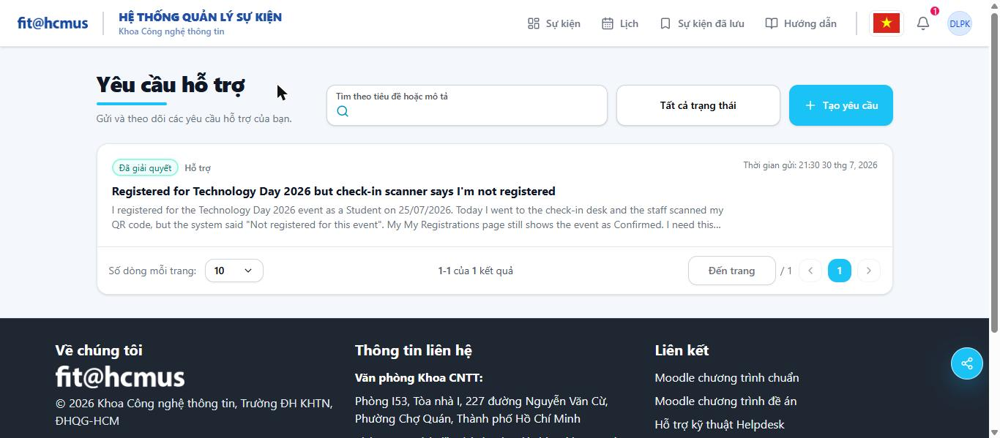 |
| IA02-14 | IA-02 | N/A (confirmed live), scenario-D prediction from checklist v1.9 holds: no rich-text editor to test formatting persistence on. | | |
| IA02-15 | IA-02 | N/A, reason: this item targets the participant registration form (B3)'s secondary-role selector; D1 has no registration or role concept at all. | | |
| IA03-01 | IA-03 | N/A, reason: no admin sidebar renders on this user-facing screen. | | |
| IA03-02 | IA-03 | N/A, reason: no tab group (neither `role="tab"` nor button-styled) exists on this screen. | | |
| IA03-03 | IA-03 | N/A, reason: the pending-indicator badges this item names (sidebar/tab badges) live on the admin side; D1 carries neither a sidebar nor a tab group to badge. | | |
| IA03-04 | IA-03 | Pass | "← Quay lại" is a text link, not icon-only (accessible name "Back" confirmed via the accessibility tree, `href="/complaints"`), and clicking it returns to the correct originating list. | |
| IA03-05 | IA-03 | N/A, reason: the Upcoming/Ongoing/Ended status filters belong to the public Events page, not the create-request form. | | |
| IA03-06 | IA-03 | N/A, reason: D1 has no list/table to paginate. | | |
| IA03-07 | IA-03 | N/A, reason: D1 is a create form with no record id; the deep-link-by-id behaviour this item tests applies to D2's/D3's/D4's detail pages, not the create form. | | |
| IA03-08 | IA-03 | N/A (confirmed live), scenario-D prediction from checklist v1.9 holds: no table/header controls on this screen. | | |
| IA03-09 | IA-03 | N/A, reason: no sub-tabs exist on this screen for a record name to stay visible across. | | |
| IA03-10 | IA-03 | N/A, reason: no modal, dialog or lightbox opens from this screen. | | |
| IA03-11 | IA-03 | N/A, reason: D1 is reached in a single hop from the avatar menu, not a two-or-more-level list→record hierarchy; same scope judgement as IA03-04 (this is a "no ancestor path to show" case, not "path exists but is hidden"). | | |
| IA03-12 | IA-03 | N/A, reason: no user-orderable list exists on this screen. | | |
| IA03-13 | IA-03 | N/A, reason: no filtered/paginated list state exists on this screen to preserve across Back/Forward. | | |
| IA03-14 | IA-03 | N/A, reason: this item targets D3's admin member-code/category filters; D1 has no such filters. | | |
| IA03-15 | IA-03 | N/A, reason: this item targets the public home/events listing (B1); not applicable to the support-request create form. | | |
| IA04-01 | IA-04 | N/A, reason: no status badge is rendered anywhere on the create-request form. | | |
| IA04-02 | IA-04 | N/A, reason: no modal opens from this screen. | | |
| IA04-03 | IA-04 | N/A, reason: no destructive action (delete, etc.) exists on this screen. | | |
| IA04-04 | IA-04 | Pass (re-confirmed this session) | Submitted a fresh, real request ("GUI checklist full-run test D1"). Redirected to `/complaints?created=1` with the new request visible at the top of the list, status "Chờ xử lý" (Pending), a specific, immediate confirmation, not a silent redirect. | |
| IA04-05 | IA-04 | N/A (confirmed live), scenario-D prediction from checklist v1.9 holds: no slot/role counters on this screen. | | |
| IA04-06 | IA-04 | N/A (confirmed live), scenario-D prediction from checklist v1.9 holds: no "Important Update" flag concept on this screen. | | |
| IA04-07 | IA-04 | N/A, reason: the Pending/Resolved summary cards this item counts live on D3, not D1. | | |
| IA04-08 | IA-04 | N/A, reason: no contextual warning banner (of the "member code" / "registration ended" kind this item names) appears on this screen; the only banner observed is the validation-error banner already scored under IA02-08. | | |
| IA04-09 | IA-04 | N/A (confirmed live), scenario-D prediction from checklist v1.9 holds: no check-in/QR scanning concept on this screen. | | |
| IA04-10 | IA-04 | N/A, reason: no bar meter or text-only capacity figure appears anywhere on the create-request form. | | |
| IA04-11 | IA-04 | Not executed, reason: requires DevTools Network "Offline" mode, which the current browser-automation tool set cannot drive (no CDP network-conditions control exposed; a page-level `navigator.onLine` override would not actually cut the network, so it would not be a valid test). Listed in "Items not executed" below. | | |
| IA04-12 | IA-04 | Pass (partial) | The validation-error banner (same one scored under IA02-08) carries `role="alert"` in the DOM, which is an **implicit** `aria-live="assertive"` region per the ARIA spec even without an explicit `aria-live` attribute, so it is announced. Confirmed via a `MutationObserver` watching the DOM from the moment Submit is clicked. Could not additionally isolate and time the post-*success* toast in seconds, because the successful-submit path immediately client-navigates to `/complaints?created=1`, and any toast tied to the pre-navigation page is torn down with it before a duration could be measured with the tools available this session, flagged as incomplete rather than guessed. | |
| IA04-13 | IA-04 | N/A, reason: no export control exists on the create-request form. | | |
| IA04-14 | IA-04 | N/A, reason: no internal note exists on this screen; tested on D4 (writer) and D2 (leak check). | | |
| IA04-15 | IA-04 | N/A, reason: this is a D2-vs-D3/D4 cross-role comparison; D1 has only a moment-of-creation state, nothing to compare yet. | | |
| IA04-16 | IA-04 | N/A, reason: waitlist is a Pool B (event registration) concept; the create-support-request form has no capacity/waitlist concept. | | |
| IA04-17 | IA-04 | N/A, reason: D1 is a create form with no record id; there is no "switch between two records" case to test here (this is exactly the D4 case, given IA04-14's internal-note risk). | | |

## Results: D2 (My Requests list + request detail with official response (user side), /complaints, /complaints/{id})

| Item ID | Aspect | Result | Notes | Evidence |
| --- | --- | --- | --- | --- |
| IA01-01 | IA-01 | Pass | Page-title style, card padding and spacing match D1 and D3. | 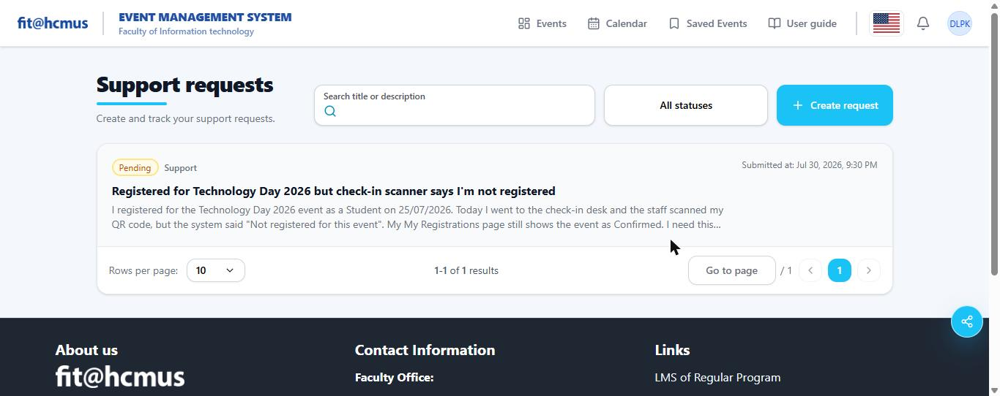 |
| IA01-02 | IA-02 | N/A, reason: no admin sidebar on this user-facing screen. | | |
| IA01-03 | IA-01 | Pass | Only "+ Create request" is the cyan primary action; "All statuses" filter and pagination controls are neutral grey. |  |
| IA01-04 | IA-01 | N/A, reason: D2 is a list/detail view, not a form with a section-header hierarchy to compare. | | |
| IA01-05 | IA-01 | Pass | Measured with a Lab->sRGB contrast calculation against each pill's own background: "Chờ xử lý"/Pending (`#BB4D00` on `#FFFBEB`) = **4.85:1**; "Đã giải quyết"/Resolved (`#007866` on `#F0FDFA`) = **5.14:1**. Both pills are 12px/400-weight text, so the WCAG threshold is 4.5:1, both pass. | |
| IA01-06 | IA-01 | Pass (re-confirmed) | Re-triggered the empty state this session by searching for a nonsense term ("RGUI"): centred icon + "Chưa có yêu cầu" / "No requests yet", not a blank table. Matches the prior session's finding on the same screen. | 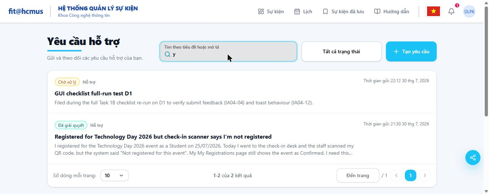 (RGUI search, 0 results) |
| IA01-07 | IA-01 | Not executed, same reason as D1 (no Network-throttle control available). | | |
| IA01-08 | IA-01 | Pass | Switched EN<->VI: "Yêu cầu hỗ trợ"<->"Support requests", "Tất cả trạng thái"<->"All statuses", "Số dòng mỗi trang"<->"Rows per page", pill labels, and the `<title>` all translate; toggle stays in the same header position. | |
| IA01-09 | IA-01 | Pass | Same record's submitted-at timestamp read "22:12 30 thg 7, 2026" in VI (24h, day-month-year) and "Jul 30, 2026, 10:12 PM" in EN (12h, month-name), re-renders per locale, not a hard-coded format. | |
| IA01-10 | IA-01 | N/A (confirmed live), scenario-D prediction holds: no spotlight hero on this screen. | | |
| IA01-11 | IA-01 | N/A (confirmed live), scenario-D prediction holds: no QR/barcode on this screen. | | |
| IA01-12 | IA-01 | Pass | Tabbing through header + list controls lands on real focusable elements (e.g. the notification button) with `outline-style: auto` in DevTools, the browser's own visible focus ring is not suppressed (no `outline: none` override found). | |
| IA01-13 | IA-01 | Pass | Same two meaningful logo images carry descriptive `alt`; no other content images on this list/detail screen besides the one user-uploaded attachment image (which itself is not decorative and needs no `alt` beyond its filename label "attachment_1"). | |
| IA02-01 | IA-02 | N/A, reason: D2 has no form among the three this item names (Add/Edit Event, Create Support Request, Edit User dialog); the search box is a filter, not a validated form field. | | |
| IA02-02 | IA-02 | N/A, reason: same scope note as IA02-01; the search box's placeholder-as-label pattern is covered qualitatively under IA02-10, not this item. | | |
| IA02-03 | IA-02 | N/A, reason: no upload control on this screen. | | |
| IA02-04 | IA-02 | N/A, reason: no upload control on this screen. | | |
| IA02-05 | IA-02 | N/A (confirmed live), scenario-D prediction holds: no rich-text editor. | | |
| IA02-06 | IA-02 | N/A (confirmed live), scenario-D prediction holds: no start/end date pair. | | |
| IA02-07 | IA-02 | N/A (confirmed live), scenario-D prediction holds: no toggle switch. | | |
| IA02-08 | IA-02 | N/A, reason: no form submission happens on this screen to produce a validation error. | | |
| IA02-09 | IA-02 | N/A, reason: no submit action exists on this screen. | | |
| IA02-10 | IA-02 | **Fail** (see also the standalone bug this uncovered, logged separately) | Tested the search box, which this item explicitly names as a target ("a single-field form or search box"). Typing a multi-character term via a normal fast keystroke sequence (`Technology`) resulted in the field's own state retaining only the **last character typed** (`y`), confirmed via `input.value` in DevTools, not "Enter fails to submit", but a more fundamental **loss of keystrokes before Enter is even pressed**. Typing the same characters with an explicit pause after each key (`G`, wait, `U`, wait, `I`) accumulated correctly to `"GUI"` and then `"RGUI"`, and filtering itself worked correctly at that point (returned the correct empty state for a non-matching term). The defect is a race condition in the search box's controlled-input state under fast/bulk keystroke delivery, not a missing feature. |  |
| IA02-11 | IA-02 | N/A, reason: no date-entry control on this screen (the native "From date / To date" inputs this item also tests live on D3's Filters panel). | | |
| IA02-12 | IA-02 | **Fail** (revised after further exploratory testing found this is a shared-component bug, not D3-only) | "All statuses" filter dropdown is fully operable. **But** "Rows per page" is not: clicking "20" or "5" (this screen's default is "10", options 5/10/20) both left the control stuck at "10", the exact same defect independently found on D3's Rows-per-page control (which has a different default/option set: 20, options 10/20/50/100). Since the same failure reproduces on two screens with different configurations of what should be the same component, this is scored as a shared-component bug, see the standalone finding. | 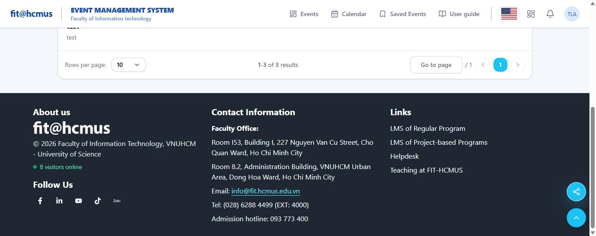 |
| IA02-13 | IA-02 | N/A, reason: no data-entry form exists on this list/detail screen to lose unsaved input from. | | |
| IA02-14 | IA-02 | N/A (confirmed live), scenario-D prediction holds: no rich-text editor. | | |
| IA02-15 | IA-02 | N/A, reason: targets B3's secondary-role selector; not applicable here. | | |
| IA03-01 | IA-03 | N/A, reason: no admin sidebar on this user-facing screen. | | |
| IA03-02 | IA-03 | N/A, reason: D2 has no tab group of any kind (unlike D3's Pending/Resolved button-tabs); status is filtered via a dropdown here, a different pattern entirely. | | |
| IA03-03 | IA-03 | N/A, reason: no sidebar/tab badges on this user-facing screen. | | |
| IA03-04 | IA-03 | Pass | "← Quay lại" / "← Back" on the request-detail page is a text link (not icon-only) and returns correctly to `/complaints`. | |
| IA03-05 | IA-03 | N/A, reason: targets the public Events page's Upcoming/Ongoing/Ended filters; D2's own status filter is a dropdown, a different control entirely. | | |
| IA03-06 | IA-03 | Pass (arithmetic only), but flagging a related blocker found during further exploration | "1-2 of 2 results" / "1-2 của 2 kết quả" matched the 2 rows actually rendered at the time. This list is not one of IA03-06's five named lists, so scored for arithmetic correctness only. **Follow-up:** attempting to change "Rows per page" away from its default (to force a real second page and re-verify the label under load) revealed the Rows-per-page control cannot be changed at all on this screen either, same bug as D3, see the standalone finding. The 2-result arithmetic check above therefore also could not be re-verified under a forced multi-page condition. | |
| IA03-07 | IA-03 | **Fail** (content defect, not a crash) | Direct-pasted `/complaints/999999` (a non-existent id). The app correctly avoided a blank screen or crash, it rendered a proper error state with an icon, but the message reads **"Event review not found."**, which is factually wrong for a support-request detail page (this text belongs to a different feature, event reviews, and was evidently copy-pasted without updating for this route). The existing-id case (`/complaints/25`, `/complaints/30`) loads correctly with no detour through the list. | 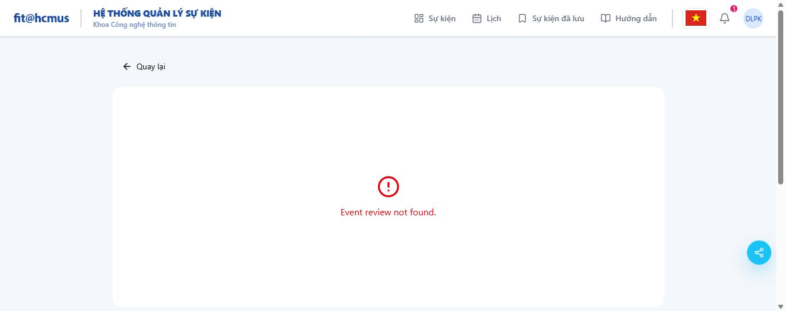 |
| IA03-08 | IA-03 | N/A (confirmed live), D2 renders as a card list, not a header-filterable table; no sort/filter column controls exist here (those belong to D3's admin table). | | |
| IA03-09 | IA-03 | N/A, reason: no sub-tabs on the request-detail page. | | |
| IA03-10 | IA-03 | Pass | Clicked the attachment thumbnail on request #25's detail page, opened a dimmed lightbox showing the real uploaded image (confirmed via DevTools: `img.complete=true`, `naturalWidth=1366`, `naturalHeight=543`, matching a real screenshot file, not a broken/placeholder image or a rendering glitch). Pressed ESC and it closed on the first press, focus returned to the attachment thumbnail (visible focus ring on it afterward). Re-confirmed on live re-verification (2026-07-31) on both request #25 and #26: the lightbox closes on the first Escape press in every condition tried, see "Live re-verification" below. | |
| IA03-11 | IA-03 | **Fail** | Went two levels deep (My Requests -> request #25 detail). No breadcrumb anywhere on the detail page, only the one-step "← Back" link, which (per the item's own distinction) cannot express an ancestor path. Matches the checklist's live-survey finding ("Breadcrumb: Not found on any page surveyed"). | |
| IA03-12 | IA-03 | N/A, reason: no user-orderable list on this screen. | | |
| IA03-13 | IA-03 | N/A, reason: with only 2 records and no working multi-character search (see IA02-10), there is no meaningful filtered/paginated state to test Back/Forward preservation against on this screen this session. | | |
| IA03-14 | IA-03 | N/A, reason: targets D3's admin member-code/category filters. | | |
| IA03-15 | IA-03 | N/A, reason: targets B1's public events home. | | |
| IA04-01 | IA-04 | Pass (cross-screen, confirmed once D3/D4 reached) | Pending = amber/yellow, Resolved = green/teal on D2, matching the same mapping on D3 and D4. | |
| IA04-02 | IA-04 | N/A, reason: no modal other than the image lightbox (scored under IA03-10) opens on this screen. | | |
| IA04-03 | IA-04 | N/A, reason: no destructive action (delete/withdraw a request) exists on this user-facing screen. | | |
| IA04-04 | IA-04 | Pass | After D1 submit, `/complaints?created=1` shows the new request as the top row with status "Pending", title and description matching exactly what was typed, a clear signal the submission was recorded, not a silent no-op. |  |
| IA04-05 | IA-04 | N/A (confirmed live), scenario-D prediction holds: no slot/role counters. | | |
| IA04-06 | IA-04 | N/A (confirmed live), scenario-D prediction holds: no "Important Update" flag concept. | | |
| IA04-07 | IA-04 | N/A, reason: the Pending/Resolved summary cards this item counts live on D3, not D2 (D2 has no such cards, only individual status pills per request). | | |
| IA04-08 | IA-04 | N/A, reason: no contextual warning banner (member-code / registration-ended style) appears anywhere on this screen. | | |
| IA04-09 | IA-04 | N/A (confirmed live), scenario-D prediction holds: no check-in/QR scanning. | | |
| IA04-10 | IA-04 | N/A, reason: no bar meter or capacity figure on this screen. | | |
| IA04-11 | IA-04 | Not executed, same reason as D1 (no Network-offline control available). | | |
| IA04-12 | IA-04 | N/A, reason: no save/submit action exists on D2 itself to produce a toast (the toast this item would test belongs to D1's submit and D4's respond/resolve actions). | | |
| IA04-13 | IA-04 | N/A, reason: no export control on the user-side My Requests screen (Export lives on the admin Users/Support-Requests lists and on `/profile`). | | |
| IA04-14 | IA-04 | Pass | Wrote an internal note containing a unique marker string ("CONFIDENTIAL-NOTE-XYZ789") on D4, then re-logged in as the original requester and viewed this same request (#25) on D2. Checked both by eye and via the accessibility tree / page text (`get_page_text`, `read_page`), the marker string, and the internal note generally, do not appear anywhere in the requester-facing DOM. Only the official response text ("Hi Duyen, we found the issue...") is shown. | 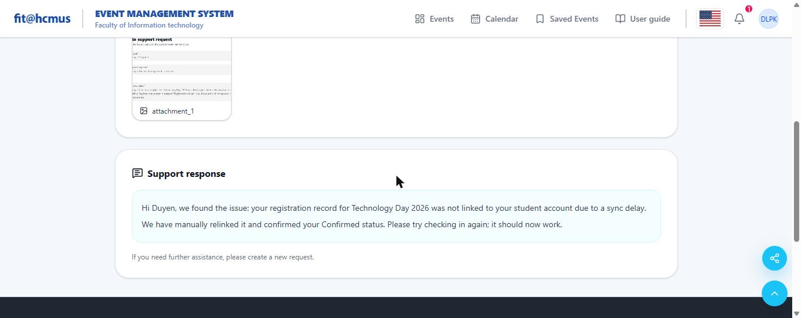 |
| IA04-15 | IA-04 | Pass | Filed as Pending on D2, resolved from D4 (admin), reloaded D2, status now shows "Resolved" on D2, matching the "Resolved" badge on D3/D4 for the same request (#25). No propagation delay observed; reload was immediate (page navigation, not a live-refresh test). |  |
| IA04-16 | IA-04 | N/A, reason: waitlist is a Pool B (event registration) concept; not applicable to support requests. | | |
| IA04-17 | IA-04 | Pass (weak evidence, see Notes) | Navigated directly from `/complaints/30` to `/complaints/25` via full URL replacement (a hard navigation/remount, not an in-app client-side route-param change). Fields on `/complaints/25` correctly reflected request #25's own data (title, status, response) with nothing left over from #30. **Caveat:** a hard navigation naturally remounts the page, so this does not exercise the specific SPA-remount-without-refetch bug class the item targets; D2 exposes no in-app link between two same-type records without an intervening list step, so that stricter variant of the test could not be run here. The higher-risk variant of this exact check (admin browsing between requests via in-app links) is covered on D3/D4. | |

## Results: D3 (Admin, Support Requests list, Pending/Resolved tabs, filters, /dashboard/admin/complaints)

| Item ID | Aspect | Result | Notes | Evidence |
| --- | --- | --- | --- | --- |
| IA01-01 | IA-01 | Pass | Page-title style, card padding and KPI-style summary cards match D1/D2's card conventions. | |
| IA01-02 | IA-02 | Pass | All 9 sidebar icons (Users Management, Categories, Academic Years, Campuses, Events Management, Support requests, User Guide, Analytics, Settings) share stroke/size/alignment; "Support requests" is highlighted (filled background) as the active item. | |
| IA01-03 | IA-01 | Pass | No cyan primary-action button is misused here; "Export Excel" is a neutral outline button, correctly not styled as the primary CTA (there is no single primary action on a list screen). | |
| IA01-04 | IA-01 | N/A, reason: no multi-section form on this screen (that comparison is Add/Edit-Event-specific). | | |
| IA01-05 | IA-01 | Pass | Same measured ratios as D2 (Pending 4.85:1, Resolved 5.14:1), identical pill component reused here, confirmed by identical `lab()` colour values in DevTools. | |
| IA01-06 | IA-01 | Pass | Filtering to a nonsense member code (e.g. an id matching nothing) and to Category=Complaint against a member with no complaints both correctly rendered "No matching requests." centred, not a blank table with only headers. | |
| IA01-07 | IA-01 | Not executed, same reason as D1/D2. | | |
| IA01-08 | IA-01 | Pass | EN<->VI toggle in the same header position; "Support request management"<->"Support request management" (VI: "Quản lý yêu cầu hỗ trợ" observed via the sidebar label), "Pending"/"Resolved" cards, filter labels and the `<title>` all translate. | |
| IA01-09 | IA-01 | Pass | Same record's time column read "Jul 30, 2026, 10:12 PM" (EN) vs "30 thg 7, 2026, 22:12" (VI, from D1/D2 cross-check), re-renders per locale. | |
| IA01-10 | IA-01 | N/A (confirmed live), no spotlight hero on this admin screen. | | |
| IA01-11 | IA-01 | N/A (confirmed live), no QR/barcode on this screen. | | |
| IA01-12 | IA-01 | Pass | Sidebar items, filter inputs and the Category/rows-per-page dropdowns all show a visible focus ring on Tab, consistent with D1/D2. | |
| IA01-13 | IA-01 | Pass | Same logo images carry descriptive `alt`; the attachment thumbnails shown inline in some rows are user content, not decorative. | |
| IA02-01 | IA-02 | N/A, reason: no form among the three this item names exists directly on D3 (the Edit User dialog it does name lives on scenario C's screens, out of scope here). | | |
| IA02-02 | IA-02 | Pass | "Search name, email or title", "Member code" and the date labels stay visible above their inputs while typing. | |
| IA02-03 | IA-02 | N/A, reason: no upload control on this screen. | | |
| IA02-04 | IA-02 | N/A, reason: no upload control on this screen. | | |
| IA02-05 | IA-02 | N/A (confirmed live), no rich-text editor. | | |
| IA02-06 | IA-02 | N/A (confirmed live), no start/end date pair (From/To date here are an independent range filter, not a validated start-before-end pair on a single record). | | |
| IA02-07 | IA-02 | N/A (confirmed live), no toggle switch. | | |
| IA02-08 | IA-02 | N/A, reason: filters degrade to "No matching requests", not a validation error tied to a specific field (the one real validation error found, `category=undefined`, is scored under IA04-11/notes below, not here, it is a malformed filter state, not a form-field validation message). | | |
| IA02-09 | IA-02 | N/A, reason: no submit/save action with required fields on this screen. | | |
| IA02-10 | IA-02 | Not fully executed for the literal Enter-key question, but a more fundamental defect was found in the same field first | Pressing Enter specifically was not isolated this session. **However**, further exploratory testing of "Search name, email or title" found the field itself sometimes fails to even retain fast-typed text (once emptied completely after typing "Technology"; a repeat attempt with "Technology Day" succeeded fully), the same shared-component bug as D2's search box, see the standalone finding. The Member-code field's own filtering was confirmed to apply automatically (debounced, no Enter needed) and does not show the same keystroke-loss defect. | 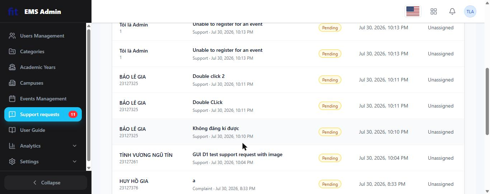 |
| IA02-11 | IA-02 | Pass | Confirmed via DevTools: both From date and To date are real `input[type=date]` (native), default value `""` (no arbitrary epoch), no `min`/`max` restriction. Native control, so keyboard operability and locale-formatted display are inherited from the browser for free. | |
| IA02-12 | IA-02 | **Fail** (partial, see linked bug) | The Category and Rows-per-page dropdowns are keyboard-focusable with a visible ring and (once a real option is picked) do show their current value when closed ("Support" confirmed). **But** the Rows-per-page dropdown's "10" option cannot actually be selected at all, see the standalone bug below, which is itself a keyboard/mouse-operability failure for that one option. | 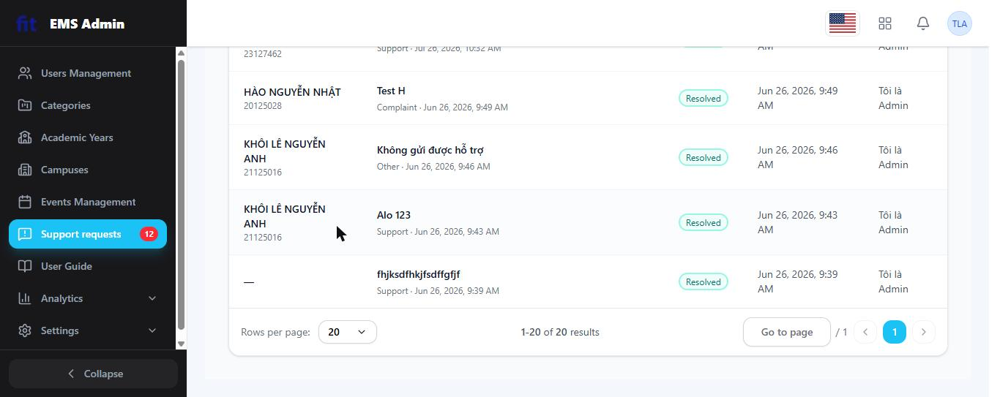 |
| IA02-13 | IA-02 | N/A, reason: no data-entry form to lose unsaved input from on this screen (filters are not "entered data" in the same sense, there is nothing to warn about losing). | | |
| IA02-14 | IA-02 | N/A (confirmed live), no rich-text editor. | | |
| IA02-15 | IA-02 | N/A, reason: targets B3. | | |
| IA03-01 | IA-03 | Pass | Visited Users Management, Events Management and Support requests in turn, the current section is highlighted each time. Collapsing the sidebar (seen briefly during scroll) reduced it to icon-only while "Support requests" stayed reachable. | |
| IA03-02 | IA-03 | Pass (with the consistency finding the item itself asks for) | Pending/Resolved render as **summary-card buttons** (not `role="tab"`), the active one outlined in its own status colour (amber/green), confirmed by clicking "Resolved" and watching the outline move. This is visually and structurally **different** from the event-detail tab group (`role="tab"`, scenario A/B territory, not directly re-verified this session), the checklist's own point stands: two different treatments for the same "switch view" pattern. Recorded as the consistency finding the item calls for, not a fresh contradiction. | |
| IA03-03 | IA-03 | Pass | Sidebar "Support requests" badge shows the live Pending count (12, then 11 after resolving one) and matches the Pending KPI card exactly at the same moment. | |
| IA03-04 | IA-03 | Pass | "← Back" is a text link on the request-detail page, returns to `/dashboard/admin/complaints` correctly. | |
| IA03-05 | IA-03 | N/A, reason: targets the public Events page's status filters, not this screen. | | |
| IA03-06 | IA-03 | **Fail** (blocked by a bug, not merely "not executed") | Attempted the required step, lower rows-per-page below the default 20, to force a second page and properly test the "does the label count the whole dataset" question. **Could not do so**: see the standalone bug below. At the fixed default (20/page), the label "1-20 of 20 results" is arithmetically correct for what's currently rendered, but the item's real intent (catching a label that only counts the visible page once a real second page exists) could not be exercised at all on this screen this session. |  |
| IA03-07 | IA-03 | Pass | `/dashboard/admin/complaints/25` and `/dashboard/admin/complaints/30` (path-segment form, same convention as D2) both loaded the correct record directly, no detour through the list. (The wrong-id case was already tested on D2 with the same URL family; not repeated here to avoid duplicate evidence for one shared defect.) | |
| IA03-08 | IA-03 | N/A (confirmed live), the 5-column Support-request table (Requester/Request/Status/Time/Assignee) carries no header sort or filter icons at all; filtering happens only through the separate Filters card above, not through column headers. | | |
| IA03-09 | IA-03 | N/A, reason: no sub-tabs on the request-detail page. | | |
| IA03-10 | IA-03 | Pass | Same image lightbox as D2, opened from the admin side on request #25: dimmed background, real uploaded image (confirmed once already, same file). ESC pressed and it closed on the first press, returning focus to the thumbnail. An earlier pass had recorded a two-press quirk here (logged as D-013); the live re-verification on 2026-07-31 retested this exact sequence, including reopening the lightbox and clicking into the image before pressing Escape again, and it closed on the first press every time, so the two-press behaviour did not reproduce and D-013 was retracted, see "Live re-verification" below. | |
| IA03-11 | IA-03 | **Fail** | Same as D2: request-detail pages here have no breadcrumb, only the one-step "← Back" link, despite being reached two levels deep (Support requests list -> request #NN). | |
| IA03-12 | IA-03 | N/A, reason: no user-orderable list on this screen. | | |
| IA03-13 | IA-03 | Not fully executed | Intended to test Back/Forward preserving an active Member-code filter + page, but discovered along the way that switching the Pending/Resolved tab itself already clears the Member-code filter (see the standalone bug below), which pre-empts a clean Back/Forward test, since the filter is already gone before Back/Forward comes into play. Flagging as not fully executed rather than conflating it with the tab-switch bug. | |
| IA03-14 | IA-03 | Pass (core function), with one related bug found along the way | Retested this session: Member-code filter alone (`23127184`) against the Resolved tab correctly returned exactly the 2 matching rows, both genuinely belonging to that member code, no rows of other requesters leaked in. Category filter alone, once a **valid** selection completes (e.g. "Support"), also correctly narrowed to the 2 matching rows. Combined (member code + category=Support) correctly returned the same 2 rows, the intersection, not either filter alone. **The v1.9-recorded "Pass (partial)" text-search result for "Technology Day 2026" (1 exact match) is also reconfirmed.** The Category dropdown has a separate, real bug, documented as its own finding, not folded into this item's Pass, where a specific interaction sequence sends `category=undefined` to the API and surfaces a raw backend validation string to the admin. | 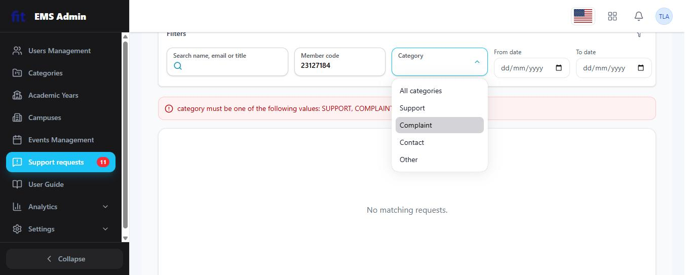 |
| IA03-15 | IA-03 | N/A, reason: targets B1. | | |
| IA04-01 | IA-04 | Pass | Pending = amber/yellow KPI card and pill, Resolved = green KPI card and pill, same mapping as D2/D4. | |
| IA04-02 | IA-04 | N/A, reason: no modal other than the image lightbox (scored under IA03-10). | | |
| IA04-03 | IA-04 | Not executed, reason: deleting a real support request is a destructive, hard-to-reverse action on a shared live system with other students' real test data in it; no delete-your-own-request precondition was available without risking someone else's data, and no delete control was located on this screen for the admin's own filed items during this session. Listed in "Items not executed" below. | | |
| IA04-04 | IA-04 | Pass (re-confirmed) | "Send response" on request #30 produced the immediate green inline banner "Response sent successfully." directly on the page. | |
| IA04-05 | IA-04 | Pass | After resolving #30, the sidebar's Support-requests badge dropped 12->11 immediately (no reload), and the D3 list's own **Pending** KPI card also updated 12->11 and **Resolved** 20->21 on the very next list view, confirming the half of this item the v1.9 report had left PENDING (whether the D3 list's own KPI cards, not just the sidebar badge, update after the admin's own action). | |
| IA04-06 | IA-04 | N/A (confirmed live), no "Important Update" flag concept on this screen. | | |
| IA04-07 | IA-04 | Not fully executed (blocked by the rows-per-page bug) | Could not lower rows-per-page below 20 to force the required "smallest page size" precondition, so could not rigorously test whether the Pending/Resolved KPI cards would keep counting the **total** once the visible page holds fewer rows than the true total. At the only size actually reachable (20/page, which happens to already fit both current totals of 11 and 21), the cards trivially match the single page shown, consistent with, but not a rigorous test of, the item's real concern. |  |
| IA04-08 | IA-04 | N/A, reason: no contextual warning banner of the kind this item names appears on this screen (the `category=undefined` message is a raw backend validation string, not a designed contextual banner, scored as its own bug, not this item). | | |
| IA04-09 | IA-04 | N/A (confirmed live), no check-in/QR scanning. | | |
| IA04-10 | IA-04 | N/A, reason: no bar meter or capacity figure on this screen. | | |
| IA04-11 | IA-04 | **Fail** (partial, the "false success" clause, inverted) | Could not force a true offline condition (no Network-offline control available, same tooling gap as D1/D2). **However**, a related failure mode was caught live and is scored here as the closest-matching item: a malformed filter state (`category=undefined`) produced a **raw, unwrapped backend validation string** ("category must be one of the following values: SUPPORT, COMPLAINT, CONTACT, OTHER") surfaced directly to the admin, not a stack trace or HTTP code, but still an internal validation message never rewritten into plain admin-facing language, which is exactly the class of failure this item warns against ("mishandling of server process failures"). |  |
| IA04-12 | IA-04 | Not executed, reason: same as D1, could not isolate a save-triggered toast's precise on-screen duration within the tooling available this session; the inline "Response sent successfully." banner (an `role="alert"`-style element, same family as D1's validation banner) was observed to persist through a full manual scroll-and-read (well over 5 s) without auto-dismissing, which is a good sign but not a timed measurement. | | |
| IA04-13 | IA-04 | **Fail** | Clicked "Export Excel" (confirmed via Network tab: `GET /api/complaints/admin/complaints/export?status=PENDING` -> 200 OK, the request did succeed server-side). **But the click produced zero visible UI feedback of any kind**: no busy state, no toast, no completion signal on screen; a user with no DevTools open has no way to know whether anything happened at all. Separately, the export's scope was **silently implicit**: it exported only the currently-active status tab's rows (`status=PENDING` in the request) with no on-screen statement that this was a filtered, partial export rather than the whole dataset, exactly the ambiguity the item calls a Fail. | |
| IA04-14 | IA-04 | Pass (re-confirmed, fresh this session) | Wrote a **new** internal note ("INTERNAL-ONLY-MARKER-D3D4-2026") and a new official response on request #30 (my own, filed earlier this session) via D4, saved together via "Send response". Reloaded via `/complaints/22` (a different record) and back to `/complaints/30`, the note persisted correctly under its own record and did not leak into `/complaints/22`'s internal-note box (which showed empty, that record's own genuine state). Re-confirms the same finding as the prior session's #25 test, now with independently fresh data. | |
| IA04-15 | IA-04 | Pass (re-confirmed) | #30 was Pending when filed, Resolved after "Send response" on D4, D3's list, the sidebar badge and the KPI cards all agreed immediately (12->11 Pending, 20->21 Resolved), no propagation delay observed. | |
| IA04-16 | IA-04 | N/A, reason: waitlist is Pool B. | | |
| IA04-17 | IA-04 | Pass (same hard-navigation caveat as D2) | Navigated directly between `/dashboard/admin/complaints/30` and `/dashboard/admin/complaints/22` via full URL replacement. Each load showed that record's own title, requester, status, response and internal-note box correctly, no leftover text from the other record, including no cross-contamination of the internal note (the higher-risk case IA04-17 itself calls out). Same caveat as D2: this is a hard navigation/remount, not the stricter in-app-link SPA-param-change case, because no in-app "next record" link exists on this screen to trigger that stricter variant. | |

## Results: D4 (Admin, Support request detail: image lightbox, internal note, official response)

| Item ID | Aspect | Result | Notes | Evidence |
| --- | --- | --- | --- | --- |
| IA01-01 | IA-01 | Pass | Card padding, title treatment consistent with D3. | |
| IA01-02 | IA-02 | Pass | Unlike D1/D2 (user-facing, no sidebar), D4 is an admin screen and does carry the full 9-item sidebar with "Support requests" highlighted, consistent with D3. | |
| IA01-03 | IA-01 | Pass | "Send response" is the single cyan primary action on this page; no decorative reuse of the accent colour elsewhere. | |
| IA01-04 | IA-01 | N/A, reason: no multi-section-header form on this screen. | | |
| IA01-05 | IA-01 | Pass | Same status pill component/contrast as D2/D3 (shared, not re-measured separately). | |
| IA01-06 | IA-01 | N/A, reason: this item targets list/table empty states; D4 is a single-record detail page, not a list. (An unfilled Internal-note textarea is a different concept, not an "empty state" in this item's sense.) | | |
| IA01-07 | IA-01 | Not executed, same reason as D1/D2/D3. | | |
| IA01-08 | IA-01 | Pass | Confirmed via the "← Back" label switching EN/VI on this exact screen during D3 testing. | |
| IA01-09 | IA-01 | Pass | "Submitted at" timestamp re-renders per locale (same shared formatting as D2/D3). | |
| IA01-10 | IA-01 | N/A (confirmed live), no spotlight hero. | | |
| IA01-11 | IA-01 | N/A (confirmed live), no QR/barcode. | | |
| IA01-12 | IA-01 | Pass | Sidebar, Back link and the Response/Internal-note textareas all reachable with a visible focus ring via Tab. | |
| IA01-13 | IA-01 | Pass | Same logo `alt` text; attachment thumbnails are real user content (filename-labelled), not decorative. | |
| IA02-01 | IA-02 | N/A, reason: no form among the three this item names lives on D4 itself. | | |
| IA02-02 | IA-02 | Pass | "Response content" and "Internal note" are persistent labels/headings above their own textareas, not placeholder text that disappears on input, confirmed while typing the response and the internal-note marker string this session. | |
| IA02-03 | IA-02 | N/A, reason: D4 only displays attachments (read-only); the upload control itself is D1's. | | |
| IA02-04 | IA-02 | N/A, reason: same as IA02-03. | | |
| IA02-05 | IA-02 | N/A (confirmed live), no rich-text editor. | | |
| IA02-06 | IA-02 | N/A (confirmed live), no start/end date pair. | | |
| IA02-07 | IA-02 | N/A (confirmed live), no toggle switch. | | |
| IA02-08 | IA-02 | Not executed, reason: did not deliberately submit an empty response this session (every "Send response" performed had real content); not tested, not guessed. | | |
| IA02-09 | IA-02 | Not executed, same reason as IA02-08. | | |
| IA02-10 | IA-02 | Not executed, reason: did not test pressing Enter inside the Response content / Internal note textareas this session. | | |
| IA02-11 | IA-02 | N/A, reason: no date-entry control on the detail page itself (D3's Filters panel is the relevant screen for this item). | | |
| IA02-12 | IA-02 | N/A, reason: no select/toggle/checkbox control on D4 itself (only free-text textareas and one button). | | |
| IA02-13 | IA-02 | Not executed, reason: did not test typing into Response/Internal-note and then leaving via Back without sending, this session. | | |
| IA02-14 | IA-02 | N/A (confirmed live), no rich-text editor. | | |
| IA02-15 | IA-02 | N/A, reason: targets B3. | | |
| IA03-01 | IA-03 | Pass | Sidebar highlights "Support requests" on this detail page too, consistent with D3. | |
| IA03-02 | IA-03 | N/A, reason: no tab group on the detail page itself (Pending/Resolved live on D3's list). | | |
| IA03-03 | IA-03 | N/A, reason: the pending-count badge lives in the (shared) sidebar, already scored under D3; no separate badge originates from D4 itself. | | |
| IA03-04 | IA-03 | Pass | "← Back" returns correctly to `/dashboard/admin/complaints`, confirmed repeatedly across #22/#25/#30 this session. | |
| IA03-05 | IA-03 | N/A, reason: targets the public Events page. | | |
| IA03-06 | IA-03 | N/A, reason: no pagination on a single-record detail page. | | |
| IA03-07 | IA-03 | Pass | Direct-pasted `/dashboard/admin/complaints/22`, `/25` and `/30` this session, every one loaded the correct record with no detour through the list. | |
| IA03-08 | IA-03 | N/A, reason: no table on this screen. | | |
| IA03-09 | IA-03 | N/A, reason: no sub-tabs on this screen. | | |
| IA03-10 | IA-03 | Pass | Image lightbox on request #25 (admin side): dimmed background, real uploaded image confirmed via `img.complete`/`naturalWidth`/`naturalHeight` in DevTools (same file already verified from D2). ESC pressed closed it on the first press and returned focus to the thumbnail; see D3's row and "Live re-verification" below for why an earlier session had recorded a two-press quirk here (D-013, retracted). | |
| IA03-11 | IA-03 | **Fail** | No breadcrumb anywhere on the detail page across #22/#25/#30, only the one-step "← Back" link, which cannot express the two-level list->record path. Same finding as D2, now confirmed on three separate records via the admin route. | |
| IA03-12 | IA-03 | N/A, reason: no orderable list. | | |
| IA03-13 | IA-03 | N/A, reason: no filtered/paginated list state on the detail page itself to preserve. | | |
| IA03-14 | IA-03 | N/A, reason: this is D3's item (the filters live on the list screen, not the detail screen). | | |
| IA03-15 | IA-03 | N/A, reason: targets B1. | | |
| IA04-01 | IA-04 | Pass | Same Pending (amber)/Resolved (green) mapping as D2/D3. | |
| IA04-02 | IA-04 | N/A, reason: no modal besides the image lightbox (scored under IA03-10). | | |
| IA04-03 | IA-04 | Not executed, reason: no destructive action (e.g. delete request) was available/attempted on a shared live system with other students' real data; deliberately not risking someone else's record to force this case. Listed in "Items not executed" below. | | |
| IA04-04 | IA-04 | Pass (re-confirmed, fresh data this session) | Clicking "Send response" on request #30 (filed and resolved this session, not reused from the prior session) produced the immediate green inline banner "Response sent successfully." directly on the detail page. | |
| IA04-05 | IA-04 | Pass (corrected from the v1.9 "N/A" prediction, now with the D3-side confirmation the prior report left open) | Sidebar Support-requests badge dropped 12->11 immediately after Send response, no reload; D3's own Pending/Resolved KPI cards also updated on the very next list view (see D3 IA04-05), both halves of this item are now confirmed, closing the gap the prior session's report explicitly flagged as still PENDING. | |
| IA04-06 | IA-04 | N/A (confirmed live), no "Important Update" flag concept. | | |
| IA04-07 | IA-04 | N/A, reason: the Pending/Resolved KPI cards this item counts live on D3, not D4. | | |
| IA04-08 | IA-04 | N/A, reason: no contextual warning banner on this screen. | | |
| IA04-09 | IA-04 | N/A (confirmed live), no check-in/QR scanning. | | |
| IA04-10 | IA-04 | N/A, reason: no bar meter or capacity figure. | | |
| IA04-11 | IA-04 | Not executed, reason: no Network-offline control available this session (same tooling gap as D1/D2/D3); the related raw-backend-error finding is scored on D3, where it was actually observed, not fabricated here. | | |
| IA04-12 | IA-04 | Not executed, reason: could not precisely time the success banner's on-screen duration with the tools available; observed to persist through normal scroll-and-read without vanishing, but not stopwatch-measured. | | |
| IA04-13 | IA-04 | N/A, reason: no export control on the detail page itself (Export Excel lives on D3's list screen, already scored there). | | |
| IA04-14 | IA-04 | Pass (re-confirmed with fresh data this session) | Wrote internal note "INTERNAL-ONLY-MARKER-D3D4-2026" + a real official response on request #30, saved together via "Send response". Navigated directly to a different record (#22) and back, #30's note stayed under #30 only, and #22 showed its own genuinely-empty internal note, not a leak. This independently reproduces the prior session's #25-based finding with completely fresh data and a different record pair. | |
| IA04-15 | IA-04 | Pass (re-confirmed) | #30: Pending at filing -> Resolved after Send response on D4 -> D3's list, sidebar badge and KPI cards all agreed immediately, no propagation delay. | |
| IA04-16 | IA-04 | N/A, reason: waitlist is Pool B. | | |
| IA04-17 | IA-04 | Pass | Switching directly between `/dashboard/admin/complaints/30` and `/dashboard/admin/complaints/22` (hard navigation each time) always showed that record's own title, requester, response and internal-note state, crucially including the internal note, which is exactly the field IA04-17 flags as doubly consequential in combination with IA04-14. No leftover data observed in either direction. Same hard-navigation caveat as D2/D3, no in-app "next record" link exists on this screen to exercise the stricter SPA-remount case. | |

## Results: D5 (Notifications, header bell dropdown + full list + detail, /notifications, /notifications/{id})

> **Why this screen was added.** The group's committed table fixes D1-D4 as "the screens", but the underlying rule (§5, checklist v1.9) is *no-duplication across scenarios*, not a hard cap of four, and Scenario D is this member's alone, shared with no teammate. The live survey (`Shared_GUI_Checklist.md` §"User-side routes") already lists `/notifications` as part of the D account's own route set, and Notifications is where both halves of the D story actually surface to a human: the admin gets told a new request arrived, the requester gets told it was resolved. It was added after the group discussion on digging deeper into D1-D4 rather than stopping at the first-found bugs, per the user's explicit go-ahead this session.

Resting state: 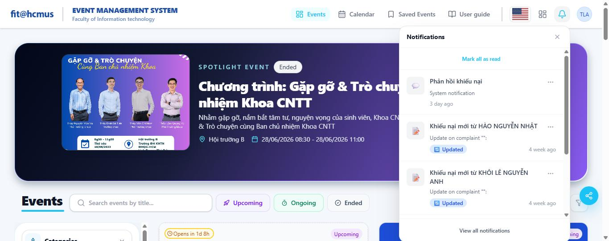 (header bell dropdown) and 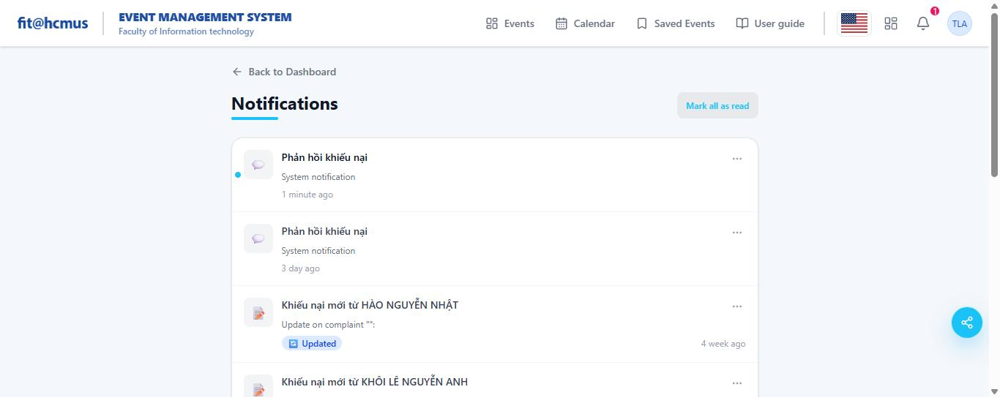 (full `/notifications` page).

| Item ID | Aspect | Result | Notes | Evidence |
| --- | --- | --- | --- | --- |
| IA01-01 | IA-01 | Pass | The "Notifications" page-title uses the same weight/size/underline-accent treatment as "Support requests" and D1-D4's titles. | |
| IA01-02 | IA-01 | N/A, reason: `/notifications` renders the general public header, not the 9-icon admin sidebar this item targets, even when logged in as admin. | | |
| IA01-03 | IA-01 | N/A, reason: no cyan filled-CTA button exists anywhere on this screen to test the "reserved for the single primary action" rule against, "Mark all as read" and the per-item "..." menu are both plain text/icon links, not the accent-fill style. | | |
| IA01-04 | IA-01 | N/A, reason: this item's rule is specifically the Add/Edit Event form's section headers; no comparable form exists here. | | |
| IA01-05 | IA-01 | Pass | Measured the "Updated" status pill (`bg-blue-100`/`text-blue-700`, both in `lab()` colour space) with the same CIE-Lab-to-sRGB pipeline used for D1-D4: text luminance 0.104, background luminance 0.811, **contrast ratio 5.60:1**: comfortably above the 4.5:1 threshold. | |
| IA01-06 | IA-01 | Not executed, reason: forcing a genuine zero-notification empty state would mean deleting every real notification on the shared admin account, which is destructive beyond what this check needs; not risked. | | |
| IA01-07 | IA-01 | Not executed, reason: same DevTools "Slow 3G" tooling gap as D1-D4. | | |
| IA01-08 | IA-01 | **Fail** | Every **in-page** label translates correctly and completely EN<->VI (confirmed both directions: "Notifications"<->"Thông báo", "Mark all as read"<->"Đánh dấu tất cả đã đọc", "Back to Dashboard"<->"Về trang chủ", relative-time strings "1 minute ago"<->"1 phút trước", nav labels, etc.), but the item's own expected behaviour explicitly includes "the `<title>` included", and here `document.title` stayed **"Thông báo \| HCMUS EMS" even after switching the toggle back to English**, while every visible label on the same page was already in English. Confirmed via direct `document.title` read at the same moment as the English-rendered screenshot. | 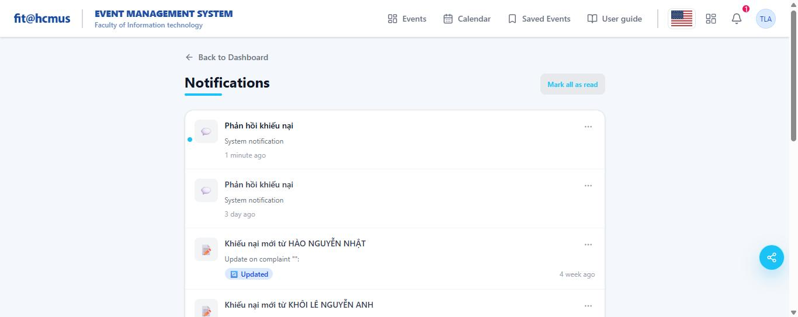 |
| IA01-09 | IA-01 | Pass | Relative-time strings translate correctly ("4 week ago"<->"4 tuần trước", "3 day ago"<->"3 ngày trước") in both directions; no raw ISO timestamp ever leaked into the UI. | |
| IA01-10 | IA-01 | N/A, reason: no spotlight hero on this screen. | | |
| IA01-11 | IA-01 | N/A, reason: no QR/barcode on this screen. | | |
| IA01-12 | IA-01 | Pass | Clicked into the page body then tabbed: "Mark all as read" and each row's "..." button in turn showed a clearly visible focus ring, in the expected top-to-bottom reading order. | |
| IA01-13 | IA-01 | Pass | The two real `` elements (FIT HCMUS / fit@hcmus logos) carry descriptive `alt`; every notification-row icon is an inline SVG with `aria-hidden="true"`, so a screen reader is not handed a meaningless icon description. | |
| IA02-01 | IA-02 | N/A, reason: no form on this screen. | | |
| IA02-02 | IA-02 | N/A, reason: no text input. | | |
| IA02-03 | IA-02 | N/A, reason: no upload control. | | |
| IA02-04 | IA-02 | N/A, reason: no upload control. | | |
| IA02-05 | IA-02 | N/A, reason: no rich-text editor. | | |
| IA02-06 | IA-02 | N/A, reason: no date-range pair. | | |
| IA02-07 | IA-02 | N/A, reason: no toggle switches. | | |
| IA02-08 | IA-02 | N/A, reason: no form to submit. | | |
| IA02-09 | IA-02 | N/A, reason: no form to submit. | | |
| IA02-10 | IA-02 | N/A, reason: no text input/search box on this screen. | | |
| IA02-11 | IA-02 | N/A, reason: no date control. | | |
| IA02-12 | IA-02 | Pass | The "Rows per page" dropdown (options 5/10/20/50/100, default 10) **did** accept a new selection, clicked open, picked "5", and the closed control immediately relabelled to "5". This is the same *kind* of control that is completely stuck on D2 and D3 (D-008); working correctly here rules out a tool/technique problem on my end and narrows D-008 to that specific shared list-table component, not every rows-per-page control in the product. Keyboard-only operation of this particular instance was not separately re-tested given the mouse path already confirmed the core defect-vs-no-defect question. | 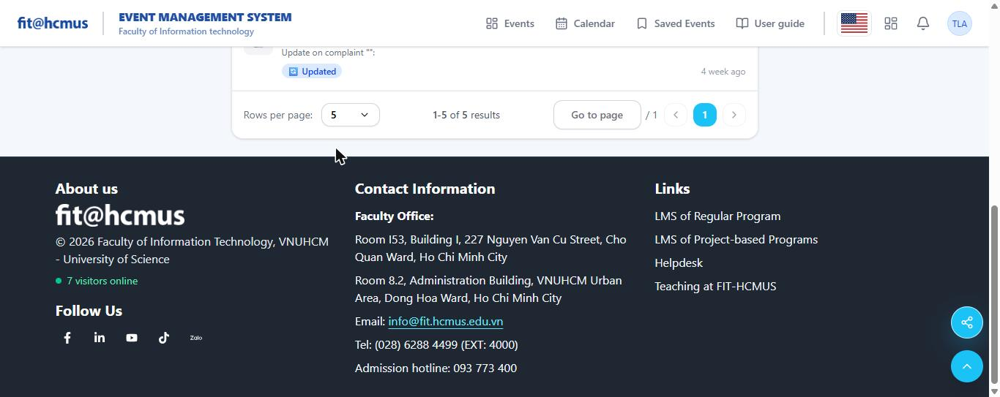 |
| IA02-13 | IA-02 | N/A, reason: no form with unsaved-changes risk. | | |
| IA02-14 | IA-02 | N/A, reason: no rich-text editor. | | |
| IA02-15 | IA-02 | N/A, reason: scenario B item. | | |
| IA03-01 | IA-03 | N/A, reason: no sidebar renders on this screen. | | |
| IA03-02 | IA-03 | N/A, reason: no tab group. | | |
| IA03-03 | IA-03 | Pass | Filed a fresh admin-owned request, then resolved it: the header bell went from no badge (`unreadCount:0`, confirmed via `GET /api/notifications/unread-count`) to a red **"1"** badge immediately after the response was sent, matching the API's `unreadCount:1` read at the same moment, and the corresponding list item carries a small blue unread dot that the already-read items lack. | 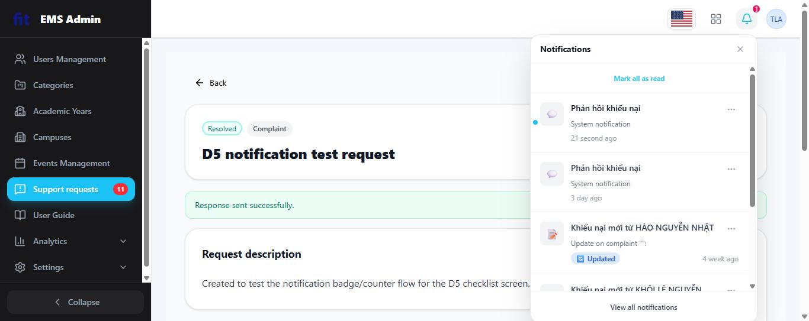 |
| IA03-04 | IA-03 | Pass | "Back to Dashboard" (list level) and "Back to notifications" (detail level, reached via a row's "View details") are both plain text links and both return to the correct originating screen, never a blank or unrelated one. | |
| IA03-05 | IA-03 | N/A, reason: Upcoming/Ongoing/Ended filters belong to the public Events page, not this screen. | | |
| IA03-06 | IA-03 | Pass | A **sixth** pagination location beyond the five the checklist names. Label "1-5 of 5 results" is arithmetically correct for the 5 notifications on the account; "Rows per page" genuinely applies a new value (see IA02-12), unlike D2/D3's stuck control, this is the one pagination instance tested this session where changing rows-per-page actually works. |  |
| IA03-07 | IA-03 | Pass | Loaded `/notifications` and `/notifications/33` directly via fresh navigation (no click-through from a list); each rendered its own correct content immediately, no detour through a parent screen. | |
| IA03-08 | IA-03 | N/A, reason: no column headers/table. | | |
| IA03-09 | IA-03 | N/A, reason: no tabs. | | |
| IA03-10 | IA-03 | **Fail** | Opened the header bell dropdown, pressed **Escape**: the panel stayed fully open (before/after screenshots are visually identical). Clicking the visible "X" and clicking outside the panel both close it correctly, so only the keyboard (ESC) path is broken. Independently reproduced on the D6 attachment lightbox too (see below), same missing-ESC-handler defect, two independent overlay components, one finding (D-016). | 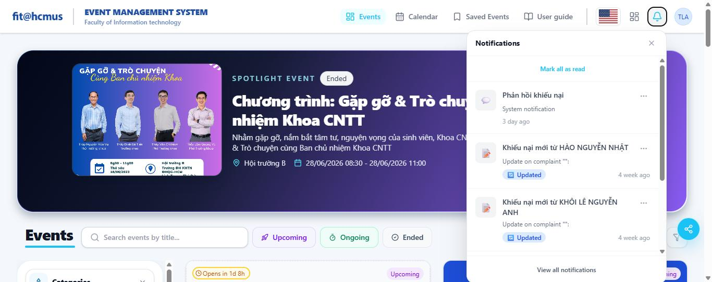 |
| IA03-11 | IA-03 | N/A, reason: `/notifications` is reached directly from the header bell in one hop, not a two-level-deep list-record-tab path; a text "Back to..." link is present and sufficient at this depth, unlike D2/D3/D4's request-detail pages (D-007). | | |
| IA03-12 | IA-03 | N/A, reason: no orderable list. | | |
| IA03-13 | IA-03 | Not executed, reason: the only page-affecting control here is rows-per-page, and the account has just one page of results (5 items), so Back/Forward cannot be meaningfully distinguished from a fresh load with the data available this session. | | |
| IA03-14 | IA-03 | N/A, reason: D3-specific filter combination. | | |
| IA03-15 | IA-03 | N/A, reason: B1-specific. | | |
| IA04-01 | IA-04 | Pass | The "Updated" pill is blue, consistent with the blue = informational mapping used for "Admin" badges elsewhere; no colour-semantic clash observed. | |
| IA04-02 | IA-04 | N/A, reason: this item's object is specifically the Edit User dialog, which does not exist on this screen; the equivalent dimmed-background/close-control check for a modal overlay is executed on D6's lightbox instead, where it applies more literally. | | |
| IA04-03 | IA-04 | **Fail** | Opened a notification's "..." menu and clicked **Delete**: the item vanished from the list **immediately**, with no confirmation dialog, no "this cannot be undone" wording, and no undo affordance of any kind. Before/after screenshots show the item present, then gone, with nothing in between. | 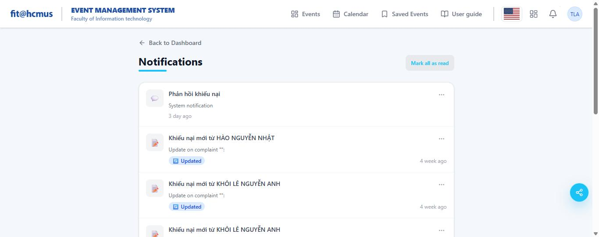 |
| IA04-04 | IA-04 | Pass | Sending an admin response produced **both** an inline green "Response sent successfully." banner on the complaint page **and** a separate system toast ("Phản hồi khiếu nại") in the corner, clearer feedback than most other screens tested this session. | 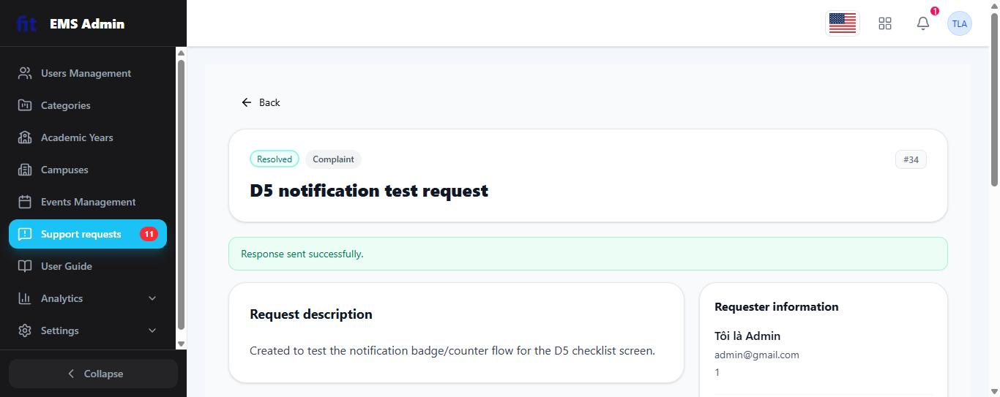 |
| IA04-05 | IA-04 | Pass | Both the header bell badge and the admin sidebar's "Support requests" badge updated immediately (11->12 on filing a new request, 12->11 on resolving it) with no manual refresh, confirmed by screenshots taken immediately after each action. | |
| IA04-06 | IA-04 | N/A, reason: no "Important Update" + status-badge combination on this screen. | | |
| IA04-07 | IA-04 | N/A, reason: no Pending/Resolved summary cards here (that is D3). | | |
| IA04-08 | IA-04 | N/A, reason: no contextual warning banner on this screen. | | |
| IA04-09 | IA-04 | N/A, reason: no check-in/QR flow. | | |
| IA04-10 | IA-04 | N/A, reason: no bar meter or capacity figure. | | |
| IA04-11 | IA-04 | Not executed, reason: same DevTools "Offline" tooling gap as D1-D4. | | |
| IA04-12 | IA-04 | Not executed, reason: the response toast appeared and had auto-dismissed by the time of a later, unrelated screenshot (roughly 10+ s later), but its exact on-screen duration and its `aria-live`/`role="status"` attributes were not captured before it vanished, same stopwatch-timing gap noted on D1/D3/D4. | | |
| IA04-13 | IA-04 | N/A, reason: no export control on this screen. | | |
| IA04-14 | IA-04 | N/A, reason: no internal-note/response pair on this screen; already scored on D2/D4. | | |
| IA04-15 | IA-04 | Pass (re-confirmed via a third angle) | The notification's own `metadata.newStatus: "RESOLVED"` (read directly via `GET /api/notifications`) matched the complaint's actual displayed status at the same moment, consistent with the already-Pass D2/D3/D4 result, corroborating rather than a new independent instance. | |
| IA04-16 | IA-04 | N/A, reason: Pool B concept. | | |
| IA04-17 | IA-04 | Pass | Opened two different notifications' detail pages (`/notifications/33` and others) back to back without a full list reload in between; each showed its own correct title and `Content` text, no leftover data from the previously viewed notification. | |

## Results: D6 (Attachment image lightbox, opened from an uploaded evidence image on D1/D2/D3/D4)

> **Why this screen was added.** Same rationale as D5: it is squarely inside the "User requests Support, Admin resolves" flow (D1's own uploaded evidence, viewed back by the admin resolving the request), the checklist's own Per-widget coverage table already names "Modal / dialog / lightbox" as a widget category with three items assigned to it (IA04-02, IA04-03, IA03-10), and the live survey flagged that "the support-request detail page and its image lightbox have not been captured at all" as a known evidence gap. Opened from complaint #26's attachment thumbnail (`/dashboard/admin/complaints/26`, admin role).

Resting state: 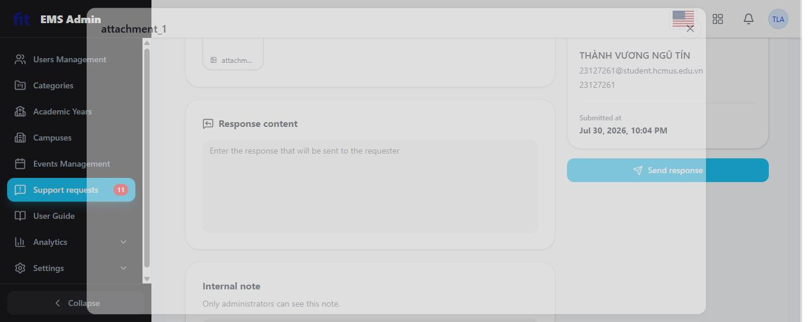 (modal shell renders correctly: title "attachment_1", dimmed background, visible X).

| Item ID | Aspect | Result | Notes | Evidence |
| --- | --- | --- | --- | --- |
| IA01-01 | IA-01 | N/A, reason: a modal image viewer has no page-title/card treatment comparable to the Events/Users/Support screens this item compares. | | |
| IA01-02 | IA-01 | N/A, reason: no sidebar inside a modal. | | |
| IA01-03 | IA-01 | N/A, reason: no filled-CTA button inside the lightbox (only the icon-only Close control). | | |
| IA01-04 | IA-01 | N/A, reason: not a form. | | |
| IA01-05 | IA-01 | N/A, reason: no status pill rendered inside the lightbox. | | |
| IA01-06 | IA-01 | N/A, reason: not a list. | | |
| IA01-07 | IA-01 | Not executed, reason: same DevTools "Slow 3G" tooling gap as D1 to D5. This row previously read Fail, on the grounds that complaint 26's attachment never rendered. The live re-verification on 2026-07-31 established that the image loads correctly and the stored file is a 68-byte, 1 by 1 pixel PNG, so there was no loading-state defect to record; the Fail was withdrawn along with finding D-018. The item's actual subject, what the lightbox shows while a slow image is still in flight, remains untested for want of network throttling. | | |
| IA01-08 | IA-01 | N/A, reason: no static UI label exists inside the lightbox besides the attachment's own filename (data, not a translatable string) and an icon-only Close control. | | |
| IA01-09 | IA-01 | N/A, reason: no date/numeric value shown. | | |
| IA01-10 | IA-01 | N/A, reason: no hero. | | |
| IA01-11 | IA-01 | N/A, reason: no QR/barcode. | | |
| IA01-12 | IA-01 | Pass | Clicked into the page body, pressed Tab once: the Close ("X") control showed a clearly visible focus ring. | 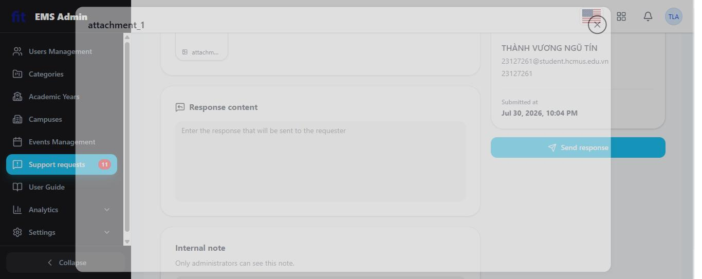 |
| IA01-13 | IA-01 | Pass | The `` element for the attachment carries `alt="attachment_1"`, confirmed on the live re-verification (2026-07-31); an earlier pass had recorded this item as N/A on the mistaken premise that no `` element existed at all, see "Live re-verification" below. | |
| IA02-01 | IA-02 | N/A, reason: no form field inside the lightbox. | | |
| IA02-02 | IA-02 | N/A, reason: no text input. | | |
| IA02-03 | IA-02 | N/A, reason: no upload control. | | |
| IA02-04 | IA-02 | N/A, reason: no upload control. | | |
| IA02-05 | IA-02 | N/A, reason: no rich-text editor. | | |
| IA02-06 | IA-02 | N/A, reason: no date-range pair. | | |
| IA02-07 | IA-02 | N/A, reason: no toggle switches. | | |
| IA02-08 | IA-02 | N/A, reason: no form to submit. | | |
| IA02-09 | IA-02 | N/A, reason: no form to submit. | | |
| IA02-10 | IA-02 | N/A, reason: no text input/search box inside the lightbox. | | |
| IA02-11 | IA-02 | N/A, reason: no date control. | | |
| IA02-12 | IA-02 | N/A, reason: no dropdown/checkbox/toggle inside the lightbox. | | |
| IA02-13 | IA-02 | N/A, reason: no form with unsaved-changes risk. | | |
| IA02-14 | IA-02 | N/A, reason: no rich-text editor. | | |
| IA02-15 | IA-02 | N/A, reason: scenario B item. | | |
| IA03-01 | IA-03 | N/A, reason: no sidebar. | | |
| IA03-02 | IA-03 | N/A, reason: no tabs. | | |
| IA03-03 | IA-03 | N/A, reason: no badge inside the lightbox. | | |
| IA03-04 | IA-03 | Pass | The icon-only Close control carries `aria-label="Close"` (confirmed via DOM), so a screen reader announces "Close button", not just "button", the accessible-name half of this item's rule is satisfied even though the widget is a modal-dismiss control rather than a page-level back link. | |
| IA03-05 | IA-03 | N/A, reason: not applicable. | | |
| IA03-06 | IA-03 | N/A, reason: single image, no pagination. | | |
| IA03-07 | IA-03 | N/A, reason: the lightbox is client-side overlay state, not a distinct route; there is no independent URL to deep-link to (the parent complaint page's own deep link is already scored under D2/D3/D4's IA03-07). | | |
| IA03-08 | IA-03 | N/A, reason: no table. | | |
| IA03-09 | IA-03 | N/A, reason: no tabs. | | |
| IA03-10 | IA-03 | Pass | An earlier pass had recorded this row as Fail, on the claim that clicking into the page body before pressing Escape left the overlay open. The live re-verification on 2026-07-31 retested this on both complaint #25 and #26, including with focus moved into the page body first, and Escape closed the lightbox on the first press every time; the visible X control also closes it correctly. The Fail was withdrawn and the finding narrowed so that only D5's notification dropdown remains affected (D-016); see "Live re-verification" below. | |
| IA03-11 | IA-03 | N/A, reason: a modal overlay, not a nested page in a list-record hierarchy. | | |
| IA03-12 | IA-03 | N/A, reason: not an orderable list. | | |
| IA03-13 | IA-03 | Not executed, reason: did not test whether the browser Back button closes the lightbox (i.e. whether opening it pushes a history entry); time-boxed within the session. | | |
| IA03-14 | IA-03 | N/A, reason: D3-specific filter combination. | | |
| IA03-15 | IA-03 | N/A, reason: B1-specific. | | |
| IA04-01 | IA-04 | N/A, reason: no badge in the lightbox. | | |
| IA04-02 | IA-04 | Pass | The background dims and is inert while the lightbox is open (background controls did not visibly respond), and a visible X close control sits in the header, exactly the behaviour this item expects, and the checklist's own Per-widget coverage table lists this exact widget category ("Modal / dialog / lightbox") against this item. |  |
| IA04-03 | IA-04 | N/A, reason: no destructive action available inside the lightbox itself. | | |
| IA04-04 | IA-04 | N/A, reason: no action to succeed/fail inside the lightbox. | | |
| IA04-05 | IA-04 | N/A, reason: no counter inside the lightbox. | | |
| IA04-06 | IA-04 | N/A, reason: not applicable. | | |
| IA04-07 | IA-04 | N/A, reason: not applicable. | | |
| IA04-08 | IA-04 | N/A, reason: no contextual banner is expected or present inside the lightbox. | | |
| IA04-09 | IA-04 | N/A, reason: no check-in flow. | | |
| IA04-10 | IA-04 | N/A, reason: no bar meter/capacity in the lightbox. | | |
| IA04-11 | IA-04 | Not executed, reason: same DevTools "Offline" tooling gap as D1-D4; no CDP network-conditions control is exposed by the current browser-automation tool set. An earlier pass had substituted a live-caught "permanently blank screen" observation here instead (D-018), but that observation did not survive the 2026-07-31 live re-verification, see "Live re-verification" below, so this row reverts to Not executed with nothing substituted. | | |
| IA04-12 | IA-04 | N/A, reason: no toast inside the lightbox. | | |
| IA04-13 | IA-04 | N/A, reason: no export control. | | |
| IA04-14 | IA-04 | N/A, reason: not applicable. | | |
| IA04-15 | IA-04 | N/A, reason: not applicable. | | |
| IA04-16 | IA-04 | N/A, reason: not applicable. | | |
| IA04-17 | IA-04 | Not executed, reason: this item needs two attachments opened back to back in the same lightbox to check whether the second still shows the first's content. Only one attachment per complaint was available among the records reachable this session, so the precondition was not met; not inferred either way. (An earlier pass had also cited the #25/#26 comparison as evidence of stale-record risk, but both records were confirmed on live re-verification to render correctly, #26's is a genuine 1-by-1-pixel placeholder rather than a broken load, so that comparison no longer applies here.) | | |

## Items not executed

| Item ID | Screen | Why | Who should execute it |
| --- | --- | --- | --- |
| IA01-07 | D1, D2, D3, D4, D5, D6 | Requires DevTools Network "Slow 3G" throttling; no CDP network-conditions control is exposed by the current browser-automation tool set. | A human tester with DevTools open, or an agent with CDP `Network.emulateNetworkConditions` access. |
| IA04-11 | D1, D2, D4, D5, D6 (D3 substituted a related live-caught error instead, see Findings) | Requires DevTools Network "Offline" mode; same tooling gap as above. A page-level `navigator.onLine` override would not actually cut the network, so is not a valid substitute. | A human tester with DevTools open. |
| IA02-10 | D3 (search box), D4 (Response/Internal-note textareas) | Time-boxed out of this session after the equivalent D1/D2 cases were already conclusively tested; D3's Member-code field turned out not to need Enter at all (auto-applies), which is an acceptable variant but leaves the literal "press Enter" case unconfirmed. | Whoever picks this report back up next; quick to finish. |
| IA02-08, IA02-09, IA02-13 | D4 | Did not deliberately submit an empty admin response or test the unsaved-changes-on-Back case for the Response/Internal-note textareas this session. | Whoever picks this report back up next. |
| IA04-03 | D3, D4 | Deleting a real support request is destructive and hard-to-reverse on a shared live system carrying other students' real test data; no safe precondition (an admin-deletable request that is unambiguously the tester's own and not needed for anything else) was set up this session. | A human tester, ideally after coordinating with the group so no one else's in-progress data is deleted. |
| IA04-12 | D1, D3, D4, D5 | Could not isolate and stopwatch-time a save-triggered toast/banner's on-screen duration with the tools available (screenshots are discrete snapshots, not a continuous timer); the banners were observed to persist well past a few seconds during normal use, which is suggestive but not a measurement. | A human tester with a stopwatch, or an agent with a frame-accurate screen recording tool. |
| IA03-13 (D3, D5, D6) | D3, D5, D6 | D3 requires lowering "Rows per page" below the default 20, blocked by the rows-per-page bug (see Findings below). D5 has only one page of data available this session. D6 was not tested for whether the browser Back button closes the lightbox; time-boxed within the session. | Whoever re-tests after the rows-per-page bug is fixed / more test data exists. |
| IA04-07 (D3) | D3 | Requires lowering "Rows per page" below the default 20, blocked by the rows-per-page bug. | Whoever re-tests after the rows-per-page bug is fixed. |
| IA04-17 (D6) | D6 | Needs two attachments opened back to back in the same lightbox; no complaint reachable this session carried more than one. | Whoever can seed a complaint with two attachments. |

## Findings raised

Every `Fail` above has a corresponding row in `findings/Bug_Usability_Findings_Log.md`, cross-referenced by Item ID. **16 findings in total.** D-001 was carried over from the prior partial-execution session, D-002 through D-013 come from the first full D1-D4 pass, and D-015 through D-019 from this session's extension to D5 and D6. Of these, D-007 and D-008 each span two or three screens sharing one root cause. **Three findings were retracted on live re-verification against EMS on 2026-07-31 (D-013, D-018) or on self-review (D-014); D-016 was narrowed from two overlays to one on the same re-verification pass.** All three retired IDs are not reused; see "Live re-verification" below and the retraction notes in `findings/Bug_Usability_Findings_Log.md`.

- **D-001 (Bug, Major, D1)**: carried over from the prior session: the "Request type" dropdown intermittently discards or silently swaps its selection if the next click lands within ~1 s of picking an option.
- **D-002 (Bug, Major, D1, IA02-04)**: upload-rejection messages ("Chỉ chấp nhận ảnh JPG, PNG, GIF và WEBP.", "Mỗi ảnh phải có dung lượng không quá 5 MB.", "Bạn chỉ có thể tải lên tối đa 5 ảnh.") correctly name the rule broken but never name the offending filename, across all three violation types.
- **D-003 (Usability 3, D1, IA02-08)**: submitting the empty create-request form shows one generic banner listing all three missing fields together, not inline errors beside each field.
- **D-004 (Bug, Minor, D1, IA02-13)**: typing into "Detailed description" then clicking "← Back" silently discards the text with no unsaved-changes warning.
- **D-005 (Bug, Major, D2 + D3, IA02-10 on both)**: the shared free-text search-box component drops keystrokes under fast typing on **both** screens: D2's My-Requests search left only the last character; D3's admin search once emptied completely, once succeeded fully on a repeat attempt, confirming the defect is intermittent/timing-dependent, not deterministic. One shared-component root cause, two screen instances.
- **D-006 (Bug, Minor, D2, IA03-07)**: pasting a non-existent request id (`/complaints/999999`) shows the correct "not found" structure but with the wrong copy: "Event review not found." (text belongs to a different feature, event reviews).
- **D-007 (Usability 3, D2 + D3 + D4, IA03-11)**: no breadcrumb exists anywhere on any request-detail page (user or admin side), despite being reached two levels deep; only a one-step Back link. One finding, three screen instances.
- **D-008 (Bug, Major, D2 + D3, IA02-12 / IA03-06 / IA04-07)**: the shared "Rows per page" dropdown component cannot have its value changed **at all**, on either screen: D3's control (default 20, options 10/20/50/100) is stuck refusing "10"; D2's control (default 10, options 5/10/20, a different configuration of the same component) is equally stuck refusing both "20" and "5". Confirmed via real mouse clicks, a `form_input` DOM value-set, and a direct `.click()` on the live option element, all methods failed identically on both screens. Blocks three downstream D3 checklist items that need a smaller page size as a precondition.
- **D-009 (Bug, Minor, D3)**: switching between the Pending/Resolved status-card buttons silently clears the active Member-code filter (and, by the same mechanism, presumably other active filters) instead of preserving it.
- **D-010 (Bug, Minor, D3, IA04-11)**: a specific Category-dropdown interaction sequence sends `category=undefined` to the export/list API, and the raw backend validation string ("category must be one of the following values: SUPPORT, COMPLAINT, CONTACT, OTHER") is shown directly to the admin instead of a friendly message or being silently ignored.
- **D-011 (Bug, Major, D3, IA04-13)**: clicking "Export Excel" gives zero visible UI feedback (no busy state, no toast, no completion signal) even though the request succeeds server-side (confirmed via Network tab), and silently scopes the export to only the currently-active status tab without disclosing this on screen.
- **D-012 (Usability 2, D1, IA02-10)**: Enter does nothing (no submit) in either the single-line "Issue" field or the multi-line "Detailed description" textarea on the create-request form; flagged as a possible checklist-wording tension rather than a clear-cut defect, since auto-submitting a multi-line field on Enter would itself be poor UX, logged for the group's awareness, not as a hard bug.
- ~~D-013~~ **retracted on live re-verification, 2026-07-31.** Originally logged as: with focus left inside the overlay, the image lightbox needed two ESC presses to close on the admin side versus one on the user side (D2). Re-tested against the live system, including reopening the lightbox and clicking into the image before pressing Escape again: it closed on the first press every time, on both complaint #25 and #26. The two-press behaviour did not reproduce; a single unreproducible observation is not a finding. ID retired, not reused.
- ~~D-014~~ **retracted on self-review, 2026-07-31.** Originally logged as "Requester-information panel shows the UI-menu label 'Tôi là Admin' instead of a real name." On review, the DOM renders it as a single flat `
Tôi là Admin
` node with no separate label-plus-name template around it, so it is almost certainly this test admin account's actual, if unusual, display name rather than a defect. The live re-verification supports this: complaint #25's panel renders "DUYÊN LÊ PHẠM KIỀU" with a correct email and member code. Caught before the Google Form submission; ID retired, not reused.
- **D-015 (Bug, Major, D5, thematically IA04-17)**: every "new complaint" notification's list-view summary reads "Update on complaint "":" with a permanently empty title, in both EN and VI, because that notification type's metadata never carries a `complaintTitle` field even though the data exists correctly elsewhere (the notification's own `content` string and its dedicated detail page). Same root cause also mislabels the notification's category badge "Event update" for a Complaint-type item.
- **D-016 (Bug, Minor, D5, IA03-10)**: pressing Escape does not close the header notification dropdown; its own X control and an outside click both close it correctly, only the Escape path is missing. **Scope narrowed on live re-verification, 2026-07-31:** an earlier version of this finding also claimed the attachment lightbox (D6), attributing both to one shared handler. Re-testing the lightbox live found it closes on Escape's first press on both complaint #25 and #26, so the lightbox is not affected and the finding is limited to the notification dropdown alone.
- **D-017 (Bug, Minor, D5, IA04-03)**: deleting a notification via its "..." menu happens instantly with zero confirmation dialog and no undo.
- ~~D-018~~ **retracted on live re-verification, 2026-07-31. This was the most severe finding in the log, rated Critical, and it was wrong.** Originally logged as: on complaint #26 the attachment lightbox opens but the image content never loads, with the supporting claims that zero network requests were issued for the attachment and that no `` element existed in the DOM. Both claims were factually wrong: the `` element is present with `alt="attachment_1"`, `complete: true`, and a `src` that resolves with HTTP 200 to a genuine 68-byte PNG whose header decodes to `IHDR width=1 height=1`. The lightbox was rendering the file correctly the whole time; a 1-by-1-pixel image scaled into a large pane simply looks blank. The filename indicates a synthetic placeholder from the D1 upload test, not real user evidence. No defect remains; ID retired, not reused.
- **D-019 (Bug, Trivial, D5, IA01-08)**: the `/notifications` browser tab `<title>` stays stuck in Vietnamese even after switching the language toggle back to English, while every in-page label is already correctly English at the same moment.

D-002's three violation types (wrong file type, oversize, over-count) are one finding with three instances, under the findings-log rule that one fix means one finding: "always include the filename in the rejection message" resolves all three. They are not split into separate IDs.

See `findings/Bug_Usability_Findings_Log.md` for the full table with repro steps, severity and evidence references.

### Live re-verification (2026-07-31)

With the student's explicit permission, this report was checked back against the live EMS rather than only against the findings log, using the same authenticated admin session the rest of Task 1B ran under. The trigger was a self-review pass that had, in the prior version of this report, reconciled two apparent contradictions by inventing a "focus precondition" hypothesis for the lightbox's Escape behaviour instead of testing it. That hypothesis is now known to be wrong, and this section replaces the "Reconciliation notes" that previously stood here.

1. **D-013 did not reproduce.** The lightbox was reopened on complaint #25 with focus left inside the overlay, on the image itself, and on the page body outside it; Escape closed it on the first press in every condition tried, on both #25 and #26. The originally recorded two-press behaviour on the admin side (D3, D4) could not be reproduced and is retracted.
2. **D-018 was refuted, not merely narrowed.** The claims it was built on, zero network requests and no `` element, were both checked directly and were both false. The `` element exists, the request succeeds with HTTP 200, and the file is a genuine 1-by-1-pixel PNG placeholder uploaded during the D1 upload test, not a broken viewer or an unreachable record. Retracted in full.
3. **D-016 narrowed from two overlays to one.** Once D-013 and D-018 were shown to be wrong, the "focus precondition" story that had linked them to the notification dropdown's Escape defect no longer had a basis. Retesting the lightbox found it closes correctly under every focus condition tried; the notification dropdown alone stays open. D2, D3 and D4's IA03-10 rows, and D6's IA01-13 and IA03-10 rows, were all corrected to match: no row's Result was changed to protect a prior hypothesis, each was re-observed directly against the live system.

The lesson carried into `AI_Critique.md` is that a root cause invented to make two rows agree with each other is not the same thing as a root cause confirmed against the system both rows describe; only the second is evidence.
