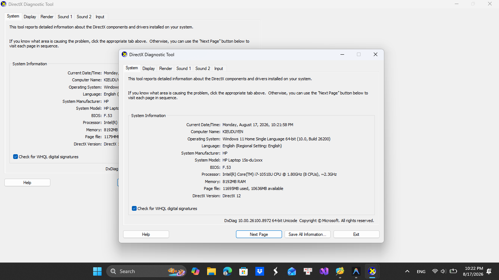
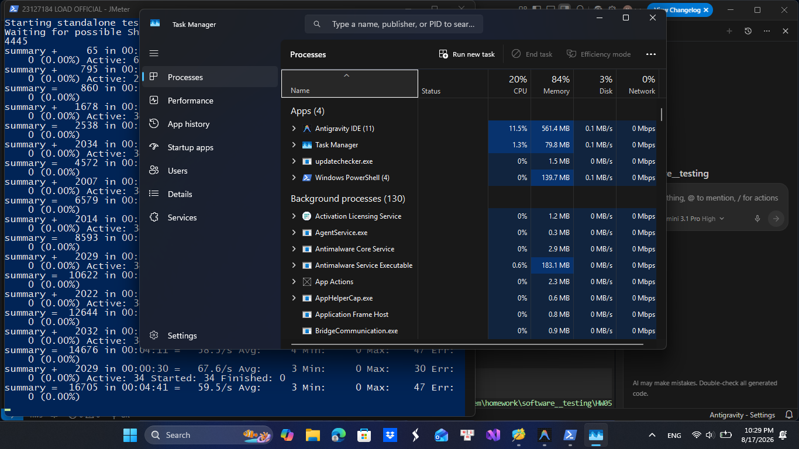
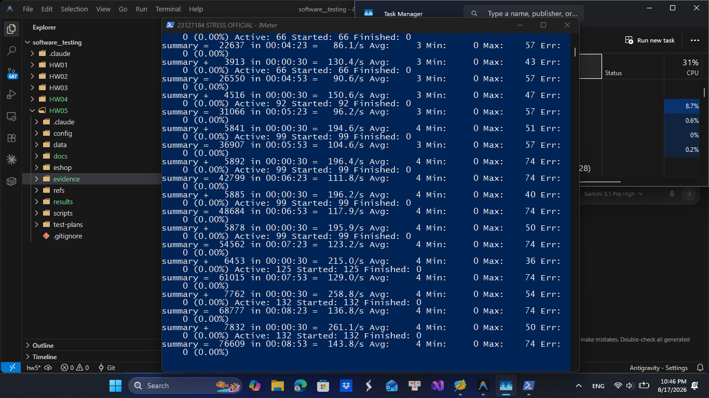
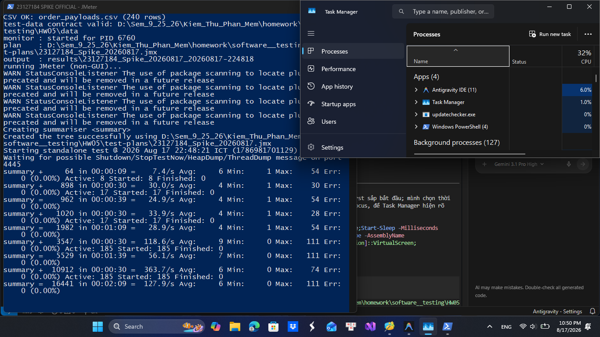
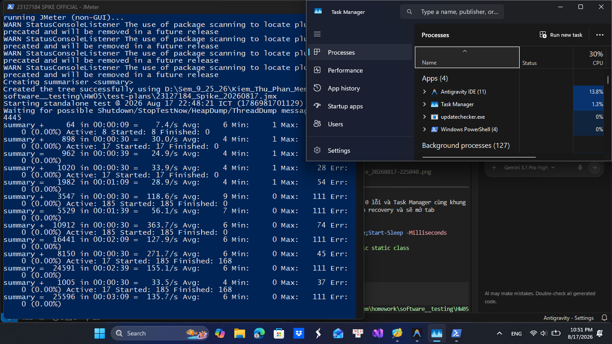
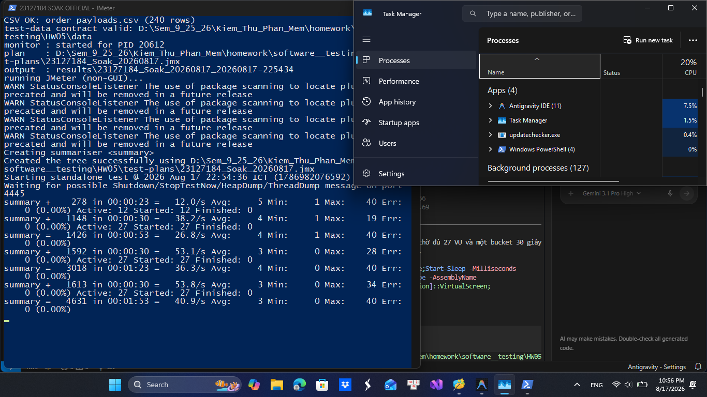
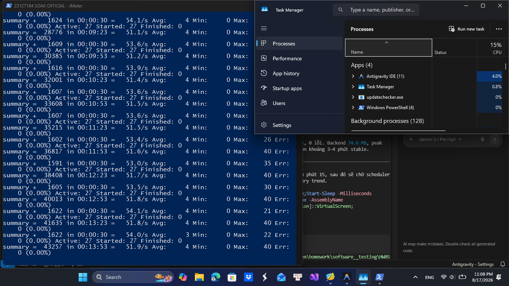
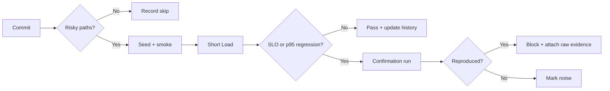

# HW05 - AI-assisted Performance Testing

**Student ID:** 23127184  
**System under test:** EShop REST backend  
**Date of official execution:** 2026-08-17 (Asia/Saigon)  
**Workflow:** Login → Search product → Product detail → Add to cart → Checkout

## 1. Executive summary

This assignment applies the seven-step performance-testing method to one
data-driven end-to-end purchase journey covering auth-heavy, read-heavy and
transactional endpoint groups. The student confirmed that the workflow is not
duplicated by another group member. OpenAI Codex assisted with requirements
review, plan generation, execution automation and initial analysis; all reported
measurements come from genuine local JMeter runs and were reviewed against the
raw JTL files.

Load, Stress, Spike and a 15-minute Soak completed without request or assertion
failures. Load sustained 64.16 req/s overall at request p95 10 ms. Stress scaled
to about 260.6 req/s at 132 VU with p95 13 ms, so the tested range did not reach
the knee. Spike reached 361.6 req/s at p95 26 ms and recovered to baseline
within 30 seconds. Soak sustained 52.8-54.5 req/s at p95 no higher than 12 ms in
full stable buckets. The demonstrated endurance threshold is at least 54.5
req/s (about 10.9 complete journeys/s) with a 172.0 MB backend working-set
ceiling on this laptop.

## 2. Environment and evidence identity

| Item | Value |
|---|---|
| Hostname | `KIEUDUYEN` |
| CPU | Intel Core i7-10510U, 4 cores / 8 logical processors |
| RAM | 8,192 MB physical |
| Operating system | Windows 11 Home Single Language, build 26200 |
| Java / JMeter | Java 21.0.12 / Apache JMeter 5.6.3 |
| Node.js | 24.4.1 |
| Backend | `http://localhost:3000`, rate limiter bypassed with `LOADTEST=1` |
| Seeded state per run | 242 users total, 5 products, 0 orders before traffic |

JMeter and the SUT shared the same 8 GB host. Before every official scenario,
the backend was stopped, restarted to recreate SQLite and clear in-memory carts,
240 accounts were registered through the API, all CSVs were validated and the
new backend PID was passed explicitly to the resource sampler.

## 3. Criteria fixed before execution

| Scope | p95 limit | Error/pass rule |
|---|---:|---|
| Login | 250 ms | Error <1%; token present |
| Search and detail | 200 ms | Error <1%; content assertion passes |
| Cart and checkout | 300 ms | Error <1%; order ID returned |
| Complete journey | 1,000 ms | At least 99% endpoint-complete journeys pass |

Spike also had to return to within 20% of pre-burst p95 within 120 seconds.
Soak had to hold 10-15 minutes, retain the latency/error criteria and report a
measured RPS and memory ceiling. Criteria were not relaxed after results were
known.

## 4. AI-assisted plan and human corrections

All official plans share the same correlated workflow and three CSV pools:
credentials, live product-derived search/ID values and checkout payloads. Login
extracts a JWT; downstream requests use it. Assertions check content as well as
HTTP status. Load uses Summary Report, Stress uses Aggregate Report and Spike
uses error-only View Results Tree, satisfying the distinct-view requirement.

Human review corrected the AI-generated approach in several material ways:

- inherited round thread counts were replaced with values derived from the
  measured 30.4 ms service time plus disclosed compressed think time;
- Stress was changed from one linear ramp into four measurable accumulating
  stages;
- absolute CSV paths were replaced by portable `data.dir` properties;
- a failing-login account was excluded from the successful journey pool to
  prevent lockout contamination;
- weak status-only checks were replaced by token, product-ID and order-ID
  assertions;
- the runner was changed to require an explicit backend PID; and
- controller rows were no longer trusted when the scheduler cut off an
  iteration before all five endpoints completed.

## 5. Scenario design

| Scenario | Executable profile | Question |
|---|---|---|
| Load | 34 VU, 68 s ramp, 668 s total | Can anticipated peak load remain healthy? |
| Stress | 33 → 66 → 99 → 132 VU, 600 s | Where does scaling stop or an SLO fail? |
| Spike | 17 baseline + 168 burst, 270 s | Can a sudden 185-VU peak recover? |
| Soak | 27 VU, 54 s ramp, 954 s total | Is 15-minute sustained behavior stable? |

Each HTTP sampler uses a Uniform Random Timer of 300-700 ms. This is compressed
relative to human browsing because hundreds more co-located threads would make
the laptop/JMeter the test subject. The report therefore describes an arrival
rate model, not literal shopper reading time.

## 6. Results

| Metric | Load | Stress | Spike | Soak |
|---|---:|---:|---:|---:|
| Request samples | 42,810 | 94,104 | 28,325 | 49,727 |
| Complete journeys | 8,547 | 18,775 | 5,591 | 9,934 |
| Requests/s overall | 64.16 | 157.00 | 105.26 | 52.17 |
| Complete journeys/s | 12.83 | 31.39 | 20.91 | 10.44 |
| Mean response time | 4.0 ms | 4.3 ms | 6.3 ms | 4.2 ms |
| Average latency | 4.02 ms | 4.30 ms | 6.27 ms | 4.17 ms |
| Request p95 / p99 / max | 10 / 20 / 52 ms | 11 / 19 / 74 ms | 19 / 37 / 111 ms | 11 / 16 / 40 ms |
| E2E p95 / max | 34 / 77 ms | 36 / 88 ms | 64 / 192 ms | 31 / 73 ms |
| Error rate | 0.00% | 0.00% | 0.00% | 0.00% |
| Bandwidth | 27.4 KB/s | 67.2 KB/s | 45.1 KB/s | 22.3 KB/s |
| Backend CPU mean / peak | 2.2 / 4.4% | 4.4 / 8.2% | 2.9 / 11.1% | 2.0 / 3.7% |
| Memory start / peak / end | 52.2 / 172.2 / 73.7 MB | 52.8 / 172.8 / 122.2 MB | 53.7 / 178.4 / 64.3 MB | 52.8 / 172.0 / 89.6 MB |

### 6.1 Load

Load delivered 12.83 complete journeys/s including ramp, 97.5% of the planned
13.16 journeys/s; stable request buckets were about 67.3 req/s. All endpoint and
E2E thresholds passed.

### 6.2 Stress

Stable stages produced about 65.9, 130.7, 196.1 and 260.6 req/s. Their request
p95 stayed between 10 and 13 ms with zero errors. Throughput continued to scale,
so 132 VU is not called the capacity. The defensible finding is that the knee is
above the tested range under this configuration.

### 6.3 Spike

The pre-burst phase was about 34.1 req/s at p95 11 ms. The burst reached 361.6
req/s at p95 26 ms. In the first full recovery bucket, throughput returned to
33.8 req/s and p95 12 ms, only 9.1% above baseline and inside the 20% rule.

### 6.4 Soak and endurance threshold

Twenty-seven VU held for 900 seconds after ramp. Full stable buckets stayed
between 52.8 and 54.5 req/s, p95 stayed at or below 12 ms and errors stayed at
zero. The backend working set started at 52.8 MB, peaked at 172.0 MB and ended
at 89.6 MB. A mid-run fall from about 170 MB to 68 MB shows garbage collection,
so this is not proof of a monotonic leak. End memory remains elevated and the
source shows carts are never cleared after checkout; a longer recovery test is
warranted.

## 7. AI analysis misinterpretation hunt

The unchanged generated analyses are stored in `docs/analysis/`; the reviewed
corrections are in `docs/reviews/03_ai_analysis_review.md`.

1. One 300 ms analyzer threshold could not represent the four pre-registered
   label/E2E budgets. Human review applied each threshold separately.
2. Successful controller rows overcounted complete journeys. For Stress, 18,797
   controller rows were marked successful but only 18,775 journeys contained
   all five endpoint labels.
3. The highest Stress stage was not a capacity measurement. At 132 VU,
   throughput still scaled and p95 remained 13 ms.
4. Overall Spike p95 19 ms hid phase behavior; the relevant values were 11 ms
   baseline, 26 ms burst and 12 ms recovery.
5. Soak end memory above start was only an accumulation signal. A large mid-run
   drop contradicted an automatic leak conclusion.

## 8. Optimization judgement

Clearing `userCarts[userId]` after successful checkout is supported by both code
and the workload model. Indexing `users.email` and enabling SQLite WAL are
plausible but unverified because no login/write bottleneck was measured. A
generic network connection pool is unfounded because this SUT uses one shared
`sqlite3.Database` handle. A conventional B-tree index for
`LIKE '%keyword%'` is also unfounded because the leading wildcard prevents a
prefix lookup.

## 9. Continuous performance testing

The proposed pipeline runs a short Load gate only for performance-sensitive
commits, confirms regressions before blocking, schedules Stress/Spike and runs
Soak for release candidates. It compares each label and the complete journey
with the median of ten same-runner baselines. It blocks on an absolute SLO or a
reproduced p95 increase greater than both 20% and 10 ms.

The trade-off is cost versus confidence: per-commit Soak would be slow and
expensive, while one noisy Load result would create false alarms. Path filters,
a fixed runner, an absolute 10 ms noise floor and confirmation runs reduce cost
and false positives; scheduled high-load tests reduce false negatives.

## 10. AI Critique (272 words)

The AI was useful for generating a repeatable JMeter workflow, but several of
its early conclusions were too confident. First, it treated the single-user
baseline capacity of 32.9 journeys per second as if it predicted multi-user
capacity. The Stress run later reached about 52 complete journeys per second at
132 VU without a knee, showing that the baseline value was only a sizing
heuristic. Second, the initial analyzer trusted successful Transaction
Controller rows. Manual comparison of the five endpoint-label counts showed
that scheduler shutdown produced partial journeys: for example, Stress had
18,797 successful controller rows but only 18,775 endpoint-complete journeys.
The analyzer was corrected to report the conservative lower bound. Third, an
automatic warning described end memory above start as a possible accumulation
signal. That warning was reasonable, but calling it a leak would have been
wrong: the Soak trace fell from about 170 MB to 68 MB during garbage collection
and ended at 89.6 MB. Source inspection instead found a specific risk: checkout
does not clear the in-memory cart. Finally, generic recommendations such as a
connection pool or a B-tree index for `LIKE '%keyword%'` sounded plausible but
did not match this implementation. It uses one shared SQLite handle, and a
leading wildcard prevents a normal prefix index from serving the query. These
misses occurred because the model initially reasoned from common performance
patterns before it had raw label counts, phase-specific timelines, and source
code. I learned to treat AI output as a testable hypothesis: pre-register
criteria, preserve raw evidence, recompute every important number, inspect the
actual code path, and make capacity or leak claims only within the measured
scope.

## 11. Conclusion and limitations

All four executed scenarios met their pre-registered latency, assertion and
error criteria. No genuine error response, crash or performance regression was
observed, so no GitHub performance issue was fabricated. The results apply only
to a five-product local database, compressed think time and a co-located load
generator with the rate limiter bypassed. They do not establish production/WAN
capacity. The prepared 198-VU Stress retest was not executed under qualifying
host conditions and is excluded from the official conclusions.
