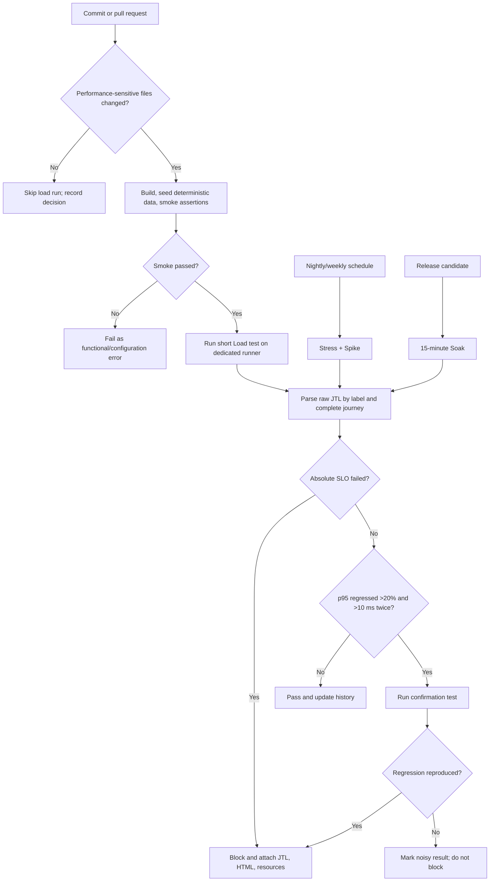

# Continuous performance-testing proposal

## Objective

The pipeline watches EShop commits, runs the cheapest test capable of detecting
a likely regression, and escalates only when risk or schedule justifies the
cost. It flags both absolute SLO failure and statistically meaningful p95
regression while preserving raw evidence for review.

## Decision flow

Text fallback: commit → path/risk filter → deterministic preflight → short Load
→ raw-JTL comparison → confirmation on regression → pass/block. Stress and
Spike run on schedule; Soak runs for release candidates.

## Trigger policy

Run the short Load gate when a commit changes backend routes, authentication,
database schema/queries, dependencies, serialization, caching, concurrency,
JMeter workflow/assertions or test data. Documentation-only and frontend-style
changes are recorded as skipped. Run Stress and Spike nightly or weekly, and the
15-minute Soak on a release candidate or after persistence/resource-management
changes. A manual label can force any scenario.

## Regression decision

For each endpoint label and the complete journey, compare the candidate with
the median of the last ten successful runs on the same runner/build profile.
Block when either:

1. a pre-registered absolute p95/error/assertion SLO fails; or
2. p95 rises by more than 20% **and** at least 10 ms, then reproduces in one
   confirmation run.

The absolute 10 ms floor prevents a change from 4 ms to 5 ms being called a
serious 25% regression. Controller rows are not accepted as complete journeys
unless all five endpoint counts support them. Store JMX, JTL, HTML, resource
CSV, build SHA, dependency lockfile and runner identity for every decision.

## Architecture and retention

- Use a dedicated, fixed-size runner; never compare a developer laptop result
  directly with CI history.
- Seed a versioned dataset and start a fresh database/process for every run.
- Disable the rate limiter only in the application-capacity job and run a
  separate security-capacity job with it enabled.
- Keep raw artifacts for 90 days and compact trend summaries for one year.
- Publish p50/p95/p99, RPS, error rate, complete journeys, CPU and memory trend
  to the pull request and a time-series dashboard.

## Trade-offs

| Trade-off | Decision |
|---|---|
| CI cost and duration | Use a short Load gate per risky commit; reserve Stress/Spike/Soak for schedules and releases. |
| False alarms from noisy hosts | Pin runner size, isolate the SUT, use historical median and require a confirmation run. |
| False negatives from small data | Keep nightly higher-load tests and periodic production-like volume tests. |
| Fast feedback vs statistical confidence | PR gate is directional; scheduled repetitions establish trends and capacity. |
| Rate-limiter realism vs app diagnosis | Maintain two explicit jobs instead of mixing limiter failures with backend saturation. |
| Artifact storage cost | Retain raw evidence for 90 days, then keep summaries plus release baselines. |

## Expected disruptive value

This model changes performance testing from an occasional end-of-assignment
activity into a commit-aware quality gate. It also makes a non-run an auditable
decision, prevents tiny percentage changes from blocking work, and escalates
expensive scenarios only when their information value justifies their cost.
