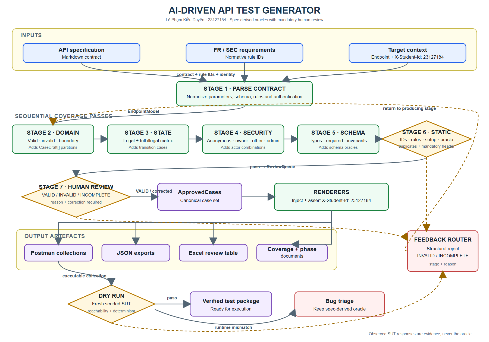

# HW06 - AI-assisted API Testing

**Student ID:** 23127184

**Student name:** Lê Phạm Kiều Duyên

**Course:** Software Testing

**SUT:** EShop - <https://github.com/ttbhanh/eshop-sut>

**Repository:** <https://github.com/KieuDuyennn/software__testing/tree/hw6/HW06>

**Latest execution date:** 2026-08-24

## 1. Scope and API selection

The three graded pool selections are API 1 (Pool A), API 3 (Pool B), and API 4
(Pool C). API 2 / FR-06 is additional Pool-A coverage and is reported separately
so it does not obscure compliance with the one-per-graded-pool rule.

| API | Pool | Requirement | Endpoint | Role in submission |
|---|---|---|---|---|
| API 1 | A | FR-01 Account registration | `POST /api/register` | Graded Pool A |
| API 2 | A | FR-06 Product detail | `GET /api/products/:id` | Additional coverage |
| API 3 | B | FR-11 Order history | `GET /api/orders/my-orders`, `GET /api/orders/:id`, cancellation | Graded Pool B |
| API 4 | C | FR-13 Dashboard | `GET /api/admin/orders`, admin status transition | Graded Pool C |

FR-13 has no dedicated dashboard endpoint. The frontend derives order count and
revenue (sum of `total_amount` for `status = delivered`) from
`GET /api/admin/orders`, so this is the tested API.

**Group uniqueness confirmation (2026-08-24):** I, Lê Phạm Kiều Duyên
(23127184), confirm that I checked with my group and that the graded combination
FR-01 Account registration (Pool A), FR-11 Order history (Pool B), and FR-13
Admin dashboard (Pool C) is unique within the group. API 2 / FR-06 is additional
Pool-A coverage and is not part of this three-API uniqueness combination.

## 2. Test environment and reproducibility

| Item | Value |
|---|---|
| Backend | Node.js + Express + SQLite, freshly reseeded per run |
| Base URL | `http://localhost:3000` |
| Runner | Postman collection format + Newman 6.2.1 |
| Reports | Newman JSON + `newman-reporter-htmlextra` HTML |
| Mandatory identity | `X-Student-Id: 23127184`, injected and asserted at collection level |
| Rate limiting | `LOADTEST=1` during suite runs to avoid invalid HTTP 429 noise |
| Full run log | `evidence/newman-console/suite_full_20260824-002523.log` |
| Gate run log | `evidence/newman-console/suite_gate_20260824-002730.log` |

Reproduce locally:

```powershell
npm install
npm run sut:install
.\scripts\Invoke-ApiTests.ps1
.\scripts\Invoke-ApiTests.ps1 -Mode gate
```

<!-- PAGEBREAK -->

## 3. AI-first method and human-review control

Each API followed four traceable stages:

1. Generate partitions for every parameter, state transitions, SEC-01..SEC-07,
   and strict response schemas.
2. Audit every generated case as VALID, INVALID, or INCOMPLETE against the
   specification and requirements, not against observed SUT behavior.
3. Add five student-designed cases targeting blind spots found in the audit.
4. Execute on a fresh database, then map failures to root-cause bugs rather
   than treating every failed assertion as a separate defect.

One generated case was INVALID: `A2-DP-006` duplicated product-id 5. It was
replaced with a percent-encoded-id case. Twenty-two cases were INCOMPLETE
because the specification could justify only a weak safety oracle or omitted
the behavior entirely. The remaining 363 final cases were VALID. Full reasoning
for all 386 rows is in `docs/phases/*/02-audit.md`.

## 4. Results summary

| API | AI-generated | Student-added | Total | Fully passed | Failed cases | Assertions passed | Assertions total |
|---|---:|---:|---:|---:|---:|---:|---:|
| API 1 - FR-01 | 121 | 5 | 126 | 69 | 57 | 544 | 606 |
| API 2 - FR-06 | 83 | 5 | 88 | 54 | 34 | 390 | 433 |
| API 3 - FR-11 | 89 | 5 | 94 | 84 | 10 | 407 | 418 |
| API 4 - FR-13 | 73 | 5 | 78 | 68 | 10 | 333 | 345 |
| **Total** | **366** | **20** | **386** | **275** | **111** | **1,674** | **1,802** |

The 128 failed assertions are expected defect-revealing results. They are
clustered into 16 confirmed bugs. The separate regression gate contains cases
that the current SUT satisfies and passed **1,262/1,262 assertions**.

## 5. API 1 - FR-01 Account registration

Generation produced 121 cases across name/email/password domains, registration
state, SEC controls, and response schemas. Audit found ambiguous limits and one
misattributed security case: `A1-SEC-013` originally blamed injected role data,
but `A1-SEC-012` proves that field is ignored. It was corrected into a direct
admin-authorization test.

Student additions cover tab/CRLF email controls, NUL in name, JSON media type
with charset, and numeric `confirmPassword`. Three of these produced new
evidence for the existing validation root cause. The run confirmed BUG-01,
BUG-02, BUG-06, and BUG-07 through BUG-12. Detailed registers:

- `docs/phases/api1-fr01-register/02-audit.md`
- `docs/phases/api1-fr01-register/03-extend.md`
- `docs/phases/api1-fr01-register/04-execute.md`

## 6. API 2 - FR-06 Product detail (additional)

The corrected final suite has 88 cases. Added cases test URL-decoded valid ids,
path/query precedence, explicit JSON content negotiation, double encoding, and
full-width Unicode digits. The run confirms three root causes: unknown or
malformed ids return `200 {}` (BUG-03), even ids expose `price` as a string
(BUG-04), and product write routes lack authentication/role checks (BUG-13).

Detailed registers are under `docs/phases/api2-fr06-product-detail/`.

## 7. API 3 - FR-11 Order history

The 94-case suite uses real two-user fixtures and walks the complete FR-10
state machine. Student additions emphasize post-conditions and cross-route
consistency. `A3-HR-001` shows that the forbidden shipping cancellation not
returns the wrong status and changes the order to `canceled`.

Confirmed root causes: anonymous/cross-user order detail IDOR (BUG-05), missing
admin role checks (BUG-06), deleted-account JWTs remain usable (BUG-14),
shipping cancellation is accepted (BUG-15), and `canceled -> delivered` is
accepted (BUG-16).

Detailed registers are under `docs/phases/api3-fr11-order-history/`.

## 8. API 4 - FR-13 Admin dashboard

The 78-case suite validates authorization, revenue/count projections, every
legal and illegal order transition, and the joined response schema. Added cases
test aggregation additivity, unique order ids, same-state terminal replay,
authorization atomicity, and one-checkout/one-row count integrity.

`A4-HR-004` independently proves a user token can make a legal admin transition
and mutate `confirmed -> shipping`. `A4-ST-016` connects the invalid
`canceled -> delivered` transition to false delivered revenue. These failures
map to BUG-06 and BUG-16.

Detailed registers are under `docs/phases/api4-fr13-admin-orders/`.

## 9. Postman features

Verified locally: collections, nested folders, local/CI/mock environments,
environment and global variables, secret variable metadata, collection- and
request-level pre-request scripts, `pm.sendRequest` fixture chains, token
capture, strict JSON-schema assertions, dynamic values, Newman CLI,
HTML/JSON reporting, selective regression gates, and CI configuration.

The signed-in Postman workspace contains all four HW06 collections and the
`EShop - Local (23127184)` environment; both views are captured under
`evidence/postman-cloud/`. A real Postman Desktop request to
`http://localhost:3000/api/products/2` returned HTTP 200, and its Console image
shows `[HW06] X-Student-Id=23127184`. A public API2 Mock Server is also running
and has recorded a real call. Collection Runner, Monitor and a successful mock
example response remain pending.

## 10. CI/CD

The workflow separates a blocking green regression gate from a non-blocking
full defect-discovery suite. The local equivalent is verified green at
1,262/1,262. The initial pushed run is authentic red evidence caused by two
Linux-unstable stateful cases; the reviewed follow-up gate passed green in
GitHub Actions. Both SHAs and run URLs are in `docs/cicd/CI_CD_REPORT.md`.

## 11. Bug summary

| Range | Count | Main themes |
|---|---:|---|
| BUG-01..BUG-12 | 12 | Registration validation, plaintext passwords, product response contract, IDOR, admin authorization, error handling |
| BUG-13..BUG-16 | 4 | Product write authorization, stale JWT, invalid cancellation, terminal-state violation |
| **Total** | **16** | Full reproduction steps and Newman messages in `docs/bugs/BUG_REPORT.md` |

Real GitHub Issue URLs are recorded in the bug report. Signed-in issue-page
screenshots for #66-#70 and real green/red Actions summaries are stored under
`evidence/screenshots/`; `evidence/EVIDENCE_INDEX.md` maps every image to its
visible verification fields.

## 12. AI-driven test generator (G9.5)

The generator uses a normalized endpoint model, four coverage passes, mandatory
human review, executable rendering, a dry-run validator, and a feedback
loop. Design and pseudocode are in `docs/design/`. A reusable implementation is
under `.claude/skills/api-test-generator/`.

The generator flow is exported at `docs/design/diagram/generator-design.png`,
with editable Mermaid source beside it. It shows the three contract inputs,
seven design stages, mandatory VALID / INVALID / INCOMPLETE human-review gate,
rendered artifacts, dry-run validation, bug triage, and feedback paths. The
current diagram is an editable draft. It requires final student review and
explanation in the narrated demonstration video.



## 13. AI Critique

See `docs/AI_CRITIQUE.md` (249 words). It identifies the duplicated case,
misattributed security failure, and missing post-condition oracles, and derives
the rule that generated cases require human approval before they become test
evidence.

## 14. AI Audit and evidence integrity

The mandatory interaction log is in `docs/ai-audit/AI_AUDIT.md`. Local Newman
JSON, HTML, and timestamped console logs are real execution artifacts. The
following are intentionally pending because they require the student/device:
Collection Runner, Monitor, a successful mock example response, final student
authorship review of the editable diagram, and the narrated YouTube video. The
mandatory executed Postman Console evidence is complete. Group uniqueness was
confirmed by the student on 2026-08-24.
